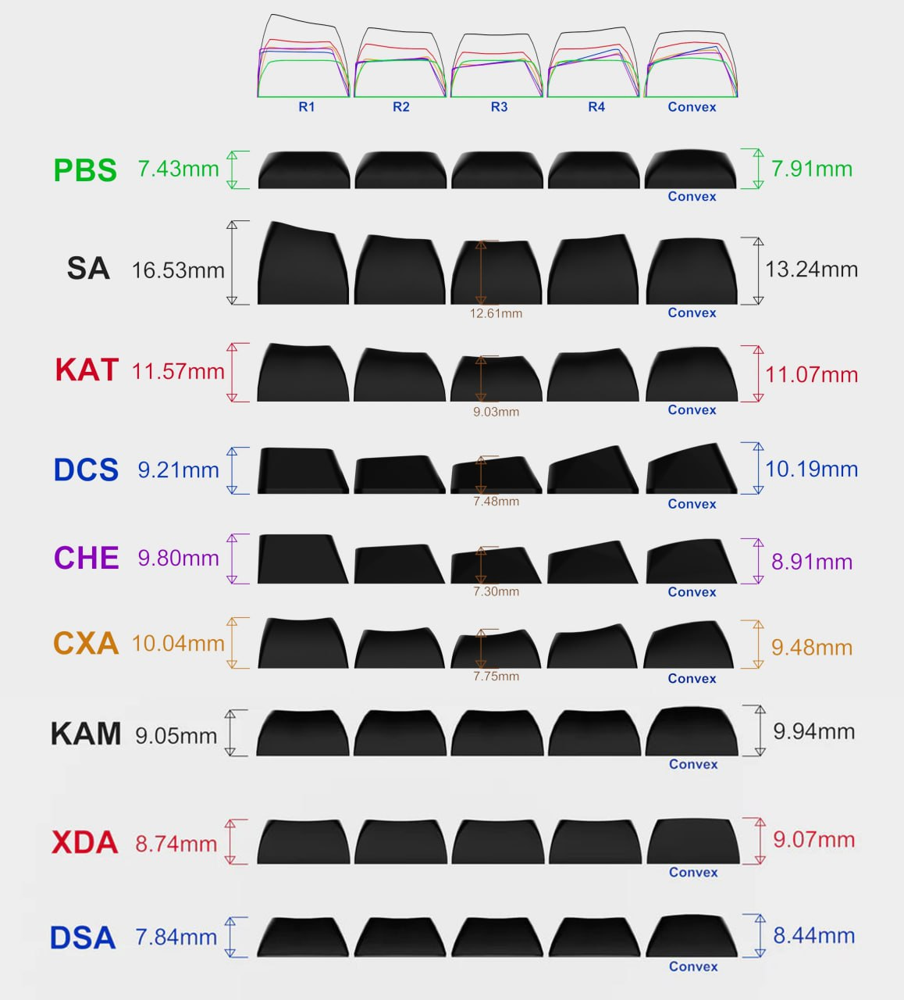
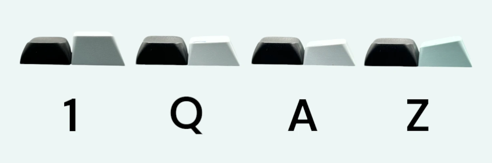
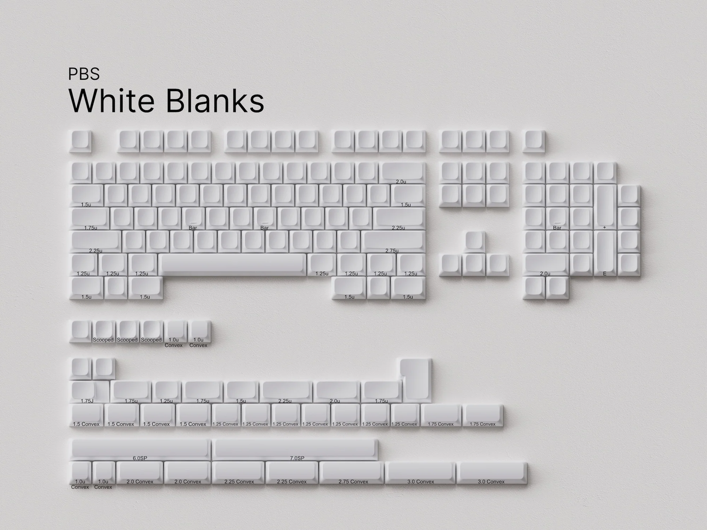
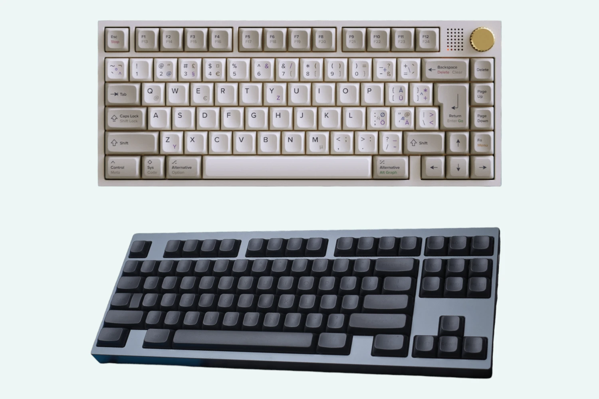

# PBS кейкапы

Owner: keebcult

автор: [@ForgottenHunter](https://t.me/ForgottenHunter), источник: [sacredkeebs.com](https://www.sacredkeebs.com/blog/pbs-profil)

отредактировано для keebcult.com: [@sensetrigger](https://t.me/sensetrigger)

# Предисловие

Я всегда скептически относился к унифицированным профилям кейкапов, поэтому подходил к тестированию новинки от CannonKeys без особого энтузиазма. Однако, PBS (Penguin Belly Slide) смогли приятно меня удивить, и именно поэтому я решил поделиться своим мнением, хотя изначально не планировал писать об этом.

На данный момент профиль только начинает свое развитие, но у него есть все предпосылки для обретения популярности.

# Что такое PBS и с чем его едят?

PBS (Рenguin Belly Slide) - профиль, разработанный известным дизайнером matt3o.
Многие знают его по MT3 и MTNU профилям, но PBS отличается от них тем, что представляет собой унифицированный профиль, где каждый ряд имеет одинаковую форму.

Одним из главных преимуществ унифицированных профилей, таких как PBS, является гибкость в использовании.

Благодаря одинаковой форме каждого ряда, кейкапы можно свободно перемещать между различными рядами, что открывает доступ к нестандартным раскладкам (Dvorak, Colemak и прочим).

Унифицированные профили так же удобны для использования на эргономичных клавиатурах, клавиатурах с низким или отрицательным наклоном и прочих нестандартных устройствах.

Основным же недостатком является не самая удобная навигация по рядам при работе в слепую (ряды не отличаются по высоте), а так же моя личная боль - постоянные нажатия на "грани/ребра" кейкапа.

# Эргономика

PBS имеет сравнительно низкий профиль, с максимальной высотой чуть более 7 мм. При переходе с Cherry профиля, самый большой диссонанс был вызван именно пробелом.

.webp)

Black - PBS spacebar / Blue - Cherry spacebar

PBS имеет сравнительно низкий профиль, с максимальной высотой чуть более 7 мм. При переходе с Cherry профиля, самый большой диссонанс был вызван именно пробелом.
Black - PBS spacebar / Blue - Cherry spacebar

Первые 2-3 часа работы, нажимая на пробел, палец постоянно ожидал встретить препятствие, но проваливался в пустоту. Это не вызывало дискомфорта, но было очень непривычно.

Зона альф (букв) не потребовала дополнительного времени на привыкание.
Разница с двумя верхними рядами (QWE и ASD) - мизерная, а основные отличия заключаются как раз в циферном ряду и нижнем буквенном ряду (ZXC).

Black - PBS / White - Cherry

Подобный профиль может быть настоящей находкой для людей, которые хотят перейти на механические клавиатуры но никак не могут привыкнуть к их высоте, а использование подставки их не устраивает.

Важным преимуществом PBS является увеличенная контактная зона для пальцев.
Передняя и задняя части кейкапа имеют цилиндрическую форму, а выемка на поверхности — сферическая. Это обеспечивает более широкую контактную площадку, при этом сама выемка для пальцев остается четко ощутимой.

-1.webp)

Для меня это оказалось решающим параметром, так как я привык работать с "плоскими" Cherry-кейкапами, имеющими большую контактную площадку.
При тестировании MTNU, и других профилей с меньшей площадкой, я часто нажимал на ребро (грань) кейкапа, что создавало дискомфорт и быстро заставляло вернуться к Cherry.

Еще одной интересной особенностью PBS кейкапов (по крайней мере в наборе бланков) является ОГРОМНЫЙ киттинг — количество кейкапов в наборе и их разнообразие. Это позволяет подобрать оптимальные варианты для различных раскладок и конфигураций клавиатур.

Из нестандартного — набор включает в себя два полноценных комплекта модификаторов: стандартные с выемками и "выпуклые" (Convex), повторяющие форму пробела. Это настоящее сокровище для фанатов эргономичных клавиатур, позволяющее подобрать наиболее удобную конфигурацию "под себя".

.webp)

# Материалы, производство, ассортимент

PBS изготавливаются на заводе Keyreative, которые известны своими KAT и KAM профилями с отличной сублимацией.

Материал - PBT, с толщиной стенок 1,5 мм. Принты наносятся с использованием технологии dyesub и reverse dyesub, что позволяет дизайнерам использовать любые шрифты, без привязки к имеющимся молдам (как в случае с Double-Shot).

Также не самым очевидным бонусом сублимации является уменьшенный MOQ (Minimum Order Quantity) , относительно Double-Shot кейкапов, что даст возможность выпускать более нишевые дизайны.

В данный момент представлены только белые и черные бланки (пустые кейкапы) от CannonKeys, но уже в ближайшее время к выпуску планируются PBS Black on Black и PBS MV Classic.

Помимо этого, уже заявлены наборы: PBS Aperture Priority, PBS Strawberry Milk и PBS Galaxy.

# Звук и тактильные ощущения

Тактильно, PBS-кейкапы напоминают KAT или CRP, благодаря своей гладкой, но не скользкой текстуре.

Касаемо звука - без сюрпризов. PBT ожидаемо имеет низкую тональность, но благодаря малой высоте кейкапов он звучит чуть мягче (глуше) по сравнению с более высокими профилями. В случае с билдами использующими PE foam, мне очень понравилась данная особенность.
Благодаря одинаковой высоте и форме кейкапов, унифицированный профиль обеспечивает более равномерный звук по всей клавиатуре, что делает тональность еще более приятной на слух.

Я тестировал PBS в разных билдах, и, как и ожидалось, они лучше всего подходят для сборок с акцентом на более низкую (thocky) или marbly тональность:

[https://youtu.be/EqEKnivy7fU](https://youtu.be/EqEKnivy7fU)

Когда я собирал билд без использования фоамов, я ожидал, что звук будет не самым удачным, поскольку обычно мне не нравится, как звучат PBT-кейкапы на таких сборках. Однако я оказался частично неправ.

Хотя PBS действительно не подходит для очень ярких (clacky) сборок, он неплохо сочетается с более мягкими и приглушёнными вариантами, такими как MX Black, Alpaca, Gateron Black Ink v2 и другими.

[https://youtu.be/niKOxR9EKGA](https://youtu.be/niKOxR9EKGA)

# Послесловие

PBS профиль оказался весьма интересным и перспективным решением для любителей унифицированных профилей.

Благодаря сочетанию эргономики, универсальности и качественных материалов, этот профиль подходит для широкого круга пользователей — от новичков до опытных энтузиастов механических клавиатур.

Лично для меня, удобство PBS было значительно выше, относительно других унифицированных профилей.

Я с удовольствием использую их чуть больше недели, и данный пост так же пишу на клавиатуре с PBS кейкапами.

Конечно, как и у любого продукта, у PBS есть свои особенности, которые могут понравиться не всем.

Например, отсутствие различий по высоте между рядами, что может затруднить навигацию при слепой печати, маленький ассортимент дизайнов (надеюсь что это временная проблема), не самая подходящая тональность для end-game билдов с высокой (clacky) тональностью.

Однако, если в ближайшее время дизайнеры наполнят ассортимент, а цены на PBS сеты будут держаться в пределах 70-80$ - будущее PBS выглядит достаточно многообещающим.

В общем, если вы давно задумывались о смене профиля или просто хотите попробовать что-то новое, PBS могут стать отличным выбором.