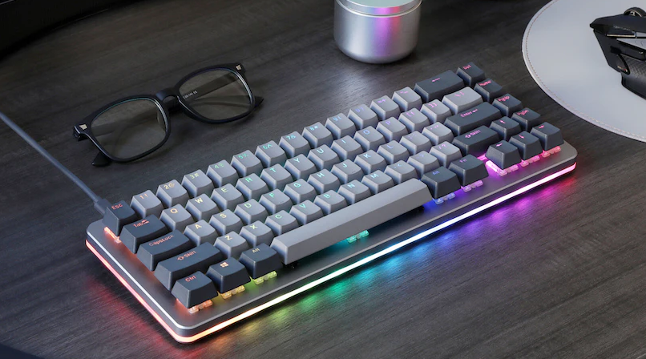

# Бортики: как не сделать клавиатуру скелетон

Owner: keebcult

Источник: [https://boosty.to/gvalchca/posts/0f17a5be-3c5e-4d98-84a5-f4c8df9f20d9](https://boosty.to/gvalchca/posts/0f17a5be-3c5e-4d98-84a5-f4c8df9f20d9)

Автор: Кирилл Шкурецкий

В общем-то топик довольно простой, с ним под силу разобраться любому начинающему дизайнеру. Но почему-то даже в 2023 году постоянно выходят клавиатуры с бортиками неправильной высоты. Особенно этим грешат псевдо-энтузиастские конторы типа KBDFans и Glorious.
Поэтому сегодня закроем эту проблему раз и навсегда, проведем ликвидацию безграмотности, и гарантируем что наши начинающие дизайнеры точно не выпустят говноклавиатуры по незнанию.

За спонсорство поста начинающему дизайнеру Скимо. Будьте как Скимо: делайте прикольные клавиатуры и заказывайте посты через подписку.

# Что такое бортики и зачем они нужны

Не хочу заниматься словоблудием и пытаться давать определение бортикам. Предлагаю просто посмотреть, как выглядит клавиатура без бортиков (или с бортиками нулевой высоты) - т.н. скелетон или barebones:

Верхней поверхностью такой клавиатуры является плейт. В него воткнуты свитчи, которые находятся над клавиатурой. Свитчи видно.

А вот та же самая клавиатура Drop ALT с бортиками:

Бортики закрывают свитчи и простираются от плейта до примерно нижней границы кейкапов.

Думаю, очевидно, что второй вариант смотрится значительно лучше. Скелетон клавиатур у нас в хобби к счастью нет, все они на прилавках магазинов.

Так что вот вам сразу определение.

<aside>
📎 Высота бортиков - расстояние между плоскостью плейта и верхней плоскостью клавиатуры.

</aside>

# Высота бортиков и высота клавиатуры

Если не вдумываться, может показаться, что высокие бортики имеют даунсайды. Например, что с ними клавиатура становится выше. Поэтому давайте взглянем на смежное определение.

<aside>
📎 Высота клавиатуры - это расстояние от поверхности стола до нижней грани пробела Cherry профиля, установленного на сделанный по спецификациям свитч.

</aside>

Такое определение считаю максимально корректным. Со мной согласны также и многие опытные дизайнеры, например ai03.
Дело в том, что при печати пользователь взаимодействует с кейкапами, а не с корпусом клавиатуры. Поэтому важно, на какой высоте находятся именно кейкапы, а не условная передняя грань. Кроме того, это определение более объективно и удобно для расчета высоты - оно не вызывает трудностей при добавлении дизайнерских элементов, типа G80-липа или даже элементарных скруглений передней грани.

Из определения вытекает, что высота бортика никак не влияет на высоту клавиатуры. Высокие бортики не делают клавиатуру менее эргономичной. Не нужно бояться делать высокие бортики.

# Высота бортиков по спецификациям Cherry

Назовем ее минимальной достаточной. Чтобы рассчитать, обратимся к tech sheet свитчей Cherry MX.

[Расстояния в дюймах.
](https://images.boosty.to/image/30345c3f-a64a-4394-ae46-ab3b599de087?change_time=1677873548&mw=1090)

Расстояния в дюймах.

Тут нас интересует ряд B. Тот что называется A - это т.н. R5 по неймингу GMK. Но по большому счету без разницы, ведь по спекам у всех рядов нижняя грань находится на одном уровне.

Расстояние от нижней грани кейкапа до низа пцб - 0.43 дюйма = 10.9 мм.
Толщина пцб - 1.6 мм.
Расстояние от верха плейта до верха пцб - 5.0 мм.

Итого высота бортика = 10.9 - 1.6 - 5.0 = 4.3 мм.

Интересный результат, да? Не совсем. Эта картинка из патента содержит ошибку. Чтобы рассчитать правильное расстояние от плейта до кейкапа, лучше прибегнуть к вот этим двум картинкам:

Из них ясно, что расстояние от плейта до кейкапа составляет 11.6 - 5.0 = 6.6 мм. Что можно подтвердить самостоятельно:

Итак. **Минимальная достаточная высота бортиков - 6.6 мм.**
Но ее использовать не стоит.

# Офф-спек свитчи и кейкапы

Не все свитчи и кейкапы соответствуют спецификациям черри. Например, многие long pole свитчи, например холи панды, имеют более длинный стем и требуют более высоких бортиков.
Также некоторые производители кейкапов не любят соответствовать стандартам, и их кепки сидят выше чем положено. Например, таким грешит ePBT. Опять же, требуются более высокие бортики.

# Оптические иллюзии

Возникает еще один прикол, связанный с углом, под которым мы смотрим на клавиатуру.
Бортик высотой 6.6 мм полностью скроет свитч, только если смотреть на клавиатуру под углом 0 градусов к плейту. То есть почти параллельно столу. Вряд ли кто-то из нас так смотрит на клавиатуры.

А под углом в 45 градусов свитч будет уже отлично видно. Некрасиво.

Поэтому бортики есть смысл сделать выше - чтобы они закрывали свитчи и отступы между кейкапами и стенками корпуса при обычном направлении взгляда.

Отступ этот, кстати, составляет 0.5 мм.

Если считать, что угол взгляда составляет 45 градусов к плейту, то к высоте бортиков следует добавить 0.5 мм (итого 7.1 мм):

[Сине-красно-зеленый треугольник равнобедренный с углами при основании 45 градусов.](https://images.boosty.to/image/c4fa081b-eb1d-4f52-b887-4c58a1e70644?change_time=1677873549&mw=1090)

Сине-красно-зеленый треугольник равнобедренный с углами при основании 45 градусов.

А если принять, что угол взгляда 60 градусов к плейту, что более реалистично, то к высоте бортиков нужно добавить аж целый 1 мм (итого 7.6 мм):

[Сине-красно-зеленый треугольник прямоугольный с углом 30 градусов, зеленая сторона в два раза больше синей.](https://images.boosty.to/image/78ac26a1-fce6-477b-b8f2-f5bbb05e7c01?change_time=1677873550&mw=1090)

Сине-красно-зеленый треугольник прямоугольный с углом 30 градусов, зеленая сторона в два раза больше синей.

В общем выходят те самые примерно **7.5 миллиметров**, о которых обычно твердят все дизайнеры клавиатур.
Но что, если добавить фаску на внутреннюю грань бортика? Она увеличит отступ, который был 0.5 мм, на некую величину. Эту величину стоит умножить на 2 и добавить к высоте бортика. Думаю, очевидно почему.
Так что любителям фасок стоит делать бортики в примерно **8 миллиметров**.

# А что если сделать бортики еще выше

Сделать-то можно, но зачем? Слишком высокие бортики также испортят эстетику клавиатуры, т.к. будут сильно закрывать нижний ряд кейкапов. Лучше всего остановиться на 7.5-8 мм, как это делают все компетентные дизайнеры.

# Бонусный оптический эффект

Еще один прикол возникает с самым верхним рядом. Через промежутки между клавишами видно заднюю стенку клавиатуры. Это нормально, но в сочетании с R0 кейкапами может выглядеть не всегда удачно: кажется, что бортик ниже, чем спереди.

Поэтому некоторые дизайнеры TKL клавиатур делают задний бортик выше, чем передний. Например, **10 мм**. Тут ничего высчитывать не нужно, это чистой воды иллюзия восприятия. Лучше всего сделать рендер клавиатуры с кейкапами и подобрать высоту на глаз.

А можно вообще над этим не запариваться - фишка сложная и неоднозначная, т.к. с ней боковой профиль клавиатуры выглядит не совсем привычным образом. Ею пользуется полтора дизайнера, порадуемся за их прошаренность.

Да и использовать эту фишку стоит только на клавиатурах с 6 или более рядами. На 60-65% смысла от нее нуль, все и так выглядит отлично.

# Итог

Дизайнишь клавиатуру?
**Сделай бортики высотой 8 мм и не парься.**