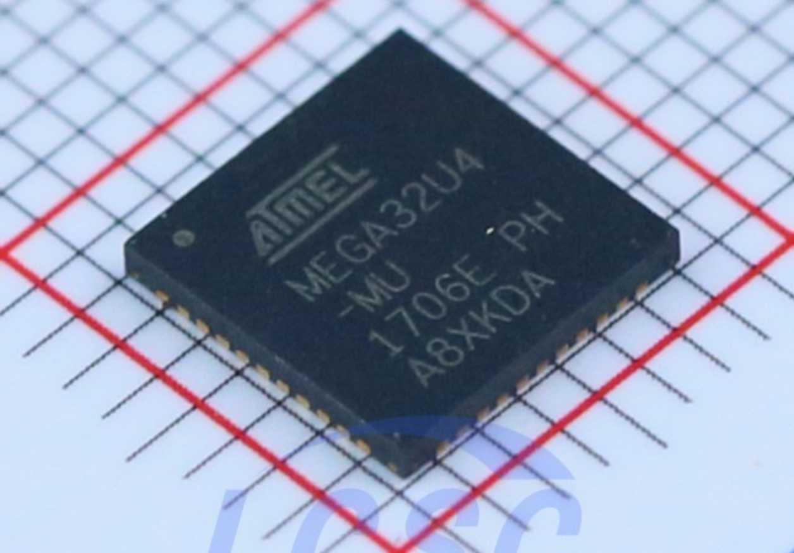

# Выбор контроллера для клавиатуры

Owner: keebcult

Автор: Иван Громов

Источник: [https://telegra.ph/Vybor-kontrollera-dlya-klaviatur-05-08](https://telegra.ph/Vybor-kontrollera-dlya-klaviatur-05-08)

Статья может быть интересна тем, кто думает над разработкой своей платы для клавиатуры и не может определиться с выбором контроллера.

Я приведу лишь наиболее популярные контроллеры, которые поддерживаются QMK, и которые я считаю наиболее важными и интересными. С полным списком контроллеров, совместимых с QMK, можно ознакомиться [здесь](https://github.com/qmk/qmk_firmware/blob/master/docs/compatible_microcontrollers.md).

Цены актуальны на май 2023 года. Контроллеры STM32 я сравнивал по принципу: "средних размеров" (48 пинов), в наличии в большем количестве у LCSC (чаще всего самые дешевые и с меньшим количеством памяти). Серым отмечены контроллеры, которых нет в наличии.

### Atmega32U4

Классика и самый популярный вариант.

Преимущества:

- Простота трассировки. Множество гайдов для создания плат на этом контроллера из-за его распространенности; сама трассировка несложная
- Доступность. Можно купить в ЧИП и ДИПе и снять с китайских Pro Micro

Недостатки:

- Мало I/O пинов. Их всего 24, чего в принципе достаточно даже для матрицы TKL-клавиатуры, но если добавлять что-то еще, то их может не хватать
- Мало флеш-памяти. 32КБ может не хватить на платы с кучей лэйаутов и RGB пресетов
- Высокая стоимость относительно других контроллеров

### STM32F072 и его младший брат STM32F042

Один из лучших вариантов за счет своих плюсов. F042 рассматривать не буду из-за его малого количества флеш-памяти (сойдет для 40% клавиатур) и более высокой цены относительно F072.

Преимущества:

- Простота трассировки. Требуется минимальное количество внешних компонентов. Самое главное, что ему не нужен кварц!
- Цена
- Много I/O пинов. У 48-ногой версии их 33

Недостатки:

- Контроллер в QFN корпусе стоит почти в 3 раза дороже, чем в QFP

### STM32F103

Cтаричок, который до сих пор актуален.

Преимущества:

- Цена
- Доступность. Можно купить в ЧИП и ДИПе и снять с китайских Blue Pill
- Много I/O пинов. У 48-ногой версии их 30

Недостатки:

- Отсутствие Bootloader. Для его заливки требуется программатор
- Контроллер в QFN корпусе стоит в 3.5 раза дороже, чем в QFP

### STM32F401 и его старший брат STM32F411

F411 от F401 отличается только большим количеством флеш-памяти и чуть большей ценой.

Преимущества:

- Цена. Самый дешевый вариант среди рассмотренных STM32, если нужен контроллер именно в QFN корпусе
- Много I/O пинов. У 48-ногой версии их 28
- Очень и очень много флеш-памяти
- Доступность. Можно купить в ЧИП и ДИПе и снять с китайских Black Pill

А вот недостатков у этого контроллера я не вижу.

### RP2040

Недавно появившийся, но уже успевший завоевать признание контроллер.

Преимущества:

- Цена. Буквально самый дешевый контроллер из всех рассмотренных
- Много I/O пинов. Всего их 30
- Есть официальные гайды по трассировке плат на этом контроллере
- Настраиваемый объем флеш-памяти. За счет того, что контроллер не имеет встроенной флеш-памяти и требует отдельную микросхему, можно поставить любой желаемый объем
- Доступность. Можно купить в ЧИП и ДИПе и снять с китайских Pi Pico

Недостатки:

- Сложность трассировки. Требуется очень много внешних компонентов, и, в целом, трассировка не самая простая для новичков

Помимо перечисленных преимуществ, у всех контроллеров STM32 можно выделить еще один плюс: наличие разнообразных моделей. Всегда есть варианты с 48/64 пинами, в QFN и QFP корпусах, с различным количеством флеш-памяти.

Но есть у них еще и некоторые минусы:

- Для прошивки требуется либо кнопка и переключатель, либо две кнопки, либо кнопка с кучей компонентов (cм. [статью от Gondolindrim](https://acheronproject.com/reset_article_1/reset_article_1/)), что занимает достаточно много места на плате
- Отсутствие EEPROM. Требуется отдельная микросхема или эмуляция этой памяти за счет флеш-памяти. Этот недостаток присущ и RP2040

Общее сравнение цен

Если вы спросите у меня, какой же контроллер все-таки выбрать, я могу ответить следующее: если вы только начинаете разбираться с созданием плат для клавиатур и не уверены в своих силах, то лучше выбрать Atmega32U4, если уверены, то лучше выбрать RP2040 либо STM32F072 (или STM32F4*1, если хотите дешевый контроллер в QFN корпусе). STM32F103 стоит выбирать только тогда, когда вы хотите собрать руками плату, ведь один Blue Pill можно купить за 90 рублей, а с него можно снять все необходимые компоненты и получить рабочую плату.

Лично я остановился на STM32F401, потому что мне важно, чтобы контроллер был в QFN корпусе (он занимает намного меньше места). Также в основном я собираю платы вручную, а этот контроллер можно снять с недорогой платы с AliExpress. Можно было бы использовать и RP2040, но за счет множества дополнительных компонентов, места на плате он занимает больше, чем STM32F401.

Надеюсь, моя статья будет полезна, удачи вам в будущих разработках!

