# Гайд по пребилдам в бюджете от 5 до 15 тысяч рублей (2024)

Owner: keebcult

автор: [@negativich](http://t.me/negativich)

редактор: [@sensetrigger](http://t.me/sensetrigger)

Почему пребилды? На мой взгляд при таком бюджете нерационально тратить стоимость хорошего пребилда на один только кит, а потом на сдачу брать какие нибудь дешманские переключатели и капы, лучше купить уже собранную клавиатуру. 

Если клавиатура здесь есть значит ее стопроцентно можно брать.

Обилия 60%-ных бордов не ждите, так как готовых шисяток почти нет.

Стоит сказать что почти все алюминиевые клавы стоит использовать с шумкой, так как дешевизна обусловлена в том числе толщиной алюминия, а значит без шумки, вероятнее всего, ваша клавиатура будет пинговать как пустая кастрюля.

В данном гайде не будет ссылок на таобао и подобные внутрикитайские площадки, думаю кому нужно - тот найдет самостоятельно.

Страница может редактироваться\дополняться.

# Низы: **+-5к₽**

## 60% - Cidoo QK61

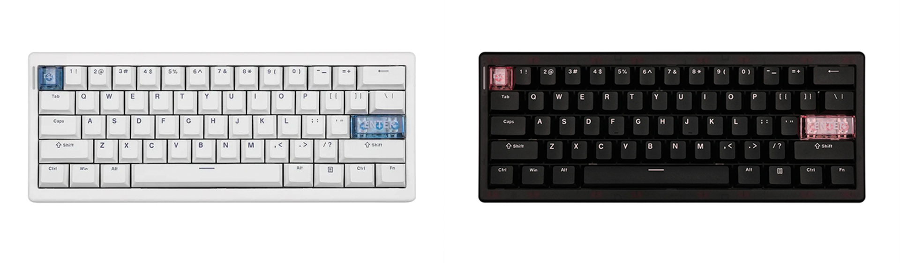

**Спеки:**

- Материал корпуса: ABS пластик
- Количество клавиш: 61
- Тип крепления: gasket mount
- Плейт: поликарбонат
- Переключатели: Cidoo Pearl White
- Хотсвап: Kailh 3 & 5 pin
- Кейкапы: Cherry профиль, PBT
- Цвета: черный/белый
- Шумоизоляция: 5 слоев (включая PET)
- Подключение: Tri-mode (провод, 2.4ггц радиоканал, bluetooth)
- Подсветка: Есть
- Аккумулятор: 3000 мАч
- Совместимость: MAC/Windows/IOS/Android
- Софт: VIA

Шисятка от CIDOO которая по сути является прокачанной версией кита GMK61, в которую ввели поддержку QMK\VIA, крайне необходимой штуки в маленьких формфакторах.
Рассказывать особенно нечего, просто хочу отметить что это единственный адекватный вариант 60% в данном бюджете.

- актуальные ссылки на озон\али:
    
    на озоне ее нет :(
    
    [https://sl.aliexpress.ru/p?key=ndmdsYd](https://sl.aliexpress.ru/p?key=ndmdsYd)
    

## **65% -** FEKER IK65

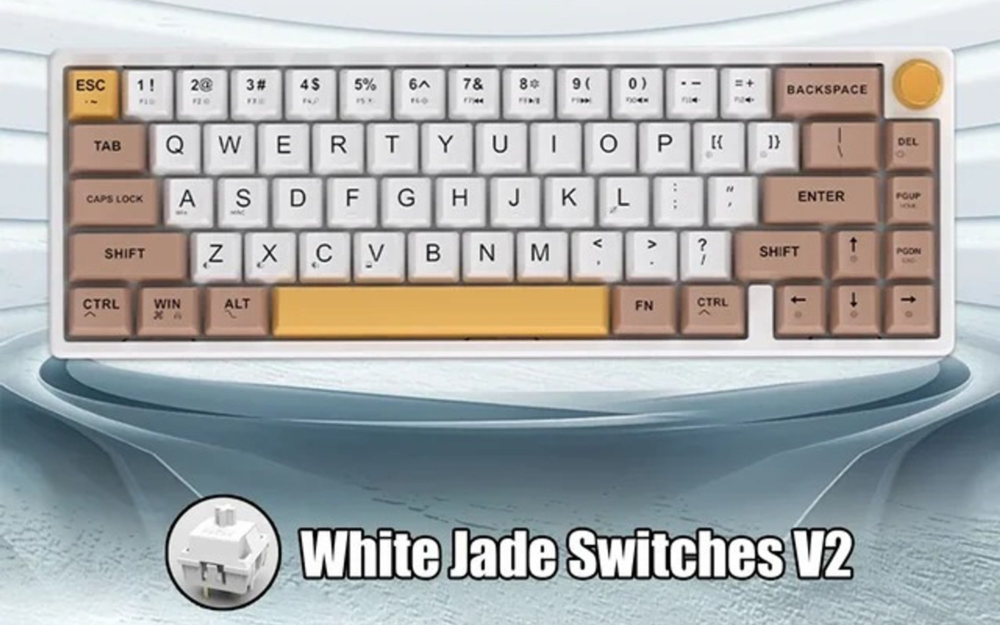

**Спеки:**

- Материал корпуса: ABS пластик
- Количество клавиш: 67
- Тип крепления: gasket mount
- Плейт: поликарбонат
- Переключатели: FEKER Линейные White Jade V2 \ Тактильные Matcha
- Хотсвап: Kailh 3 & 5 pin
- Кейкапы: OEM профиль, PBT
- Цвета: коричневый/белый
- Шумоизоляция: 5 слоев
- Подключение: Tri-mode (провод, 2.4ггц радиоканал, bluetooth)
- Подсветка: Есть
- Аккумулятор: 4000 мАч
- Совместимость: MAC/Windows/IOS/Android
- Софт: VIA

Обычный пластиковый пребилд аля GMK67. Тримод, гаскет маунт, роллер.

Не думаю что имеет смысл досконально искать минусы в клавиатурах за 5к, но можно выделить легкое поскрипывание корпуса при сильном нажатии или скручивании.

Из плюсов свичи и стабилизаторы вроде как немного смазаны, но самое крутое - присутствие VIA. Это дает нам возможность перебиндить каждую отдельную клавишу на то что нам нужно, а также иметь несколько слоев раскладок под различные задачи.

- актуальные ссылки на озон\али
    
    [https://ozon.ru/t/RZMKo65](https://ozon.ru/t/RZMKo65)
    
    [https://aliexpress.ru/item/1005005481066386.html?sku_id=12000037043795939](https://aliexpress.ru/item/1005005481066386.html?sku_id=12000037043795939)
    

## 75% - **Aula F75, Ajazz AK820, RK R75**

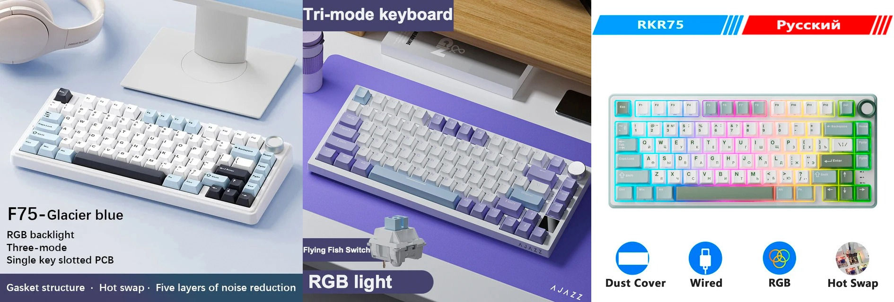

слева направо      

**Спеки:**

- Материал корпуса: АБС пластик
- Количество клавиш: 78\81\81
- Тип крепления: gasket mount
- Хотсвап: присутствует
- Плейт: поликарбонат
- Подключение: Tri-mode\Tri-mode\Wired
- Подсветка: Есть
- Совместимость: MAC/Windows/IOS/Android
- Софт: Проприетарный

Я решил объединить эти три клавиатуры в одну подкатегорию, т.к. нахожу их относительно идентичными. Могу лишь сказать, что я бы не стал брать РК Р75, так как в ней отсутствует тот самый PET слой, который делает вашу клаву более thocky. Но имеет неоспоримое преимущество для начинающих - возможность выбрать кириллицу.

Стоит также упомянуть что при покупке AK820 вы можете выбирать между разными комплектациями (в том числе с экраном!), и ее стоимость варьируется от 3900 до 6000 вечнодеревянных.

Касательно переключателей во всех трех клавиатурах - не вижу смысла за такие деньги говорить про них что либо, они все вполне нормальные и надо сказать спасибо за то что они вообще есть :)

- актуальные ссылки на озон\али
    
    **AK820**:
    
    [https://ozon.ru/t/AV5JEjP](https://www.ozon.ru/product/ajazz-klaviatura-provodnaya-ak820-angliyskaya-raskladka-belyy-siniy-1554267290/?asb2=Nz6P-RDkqr-wgdSvrWcHuIf-AGsme1SNdBtHtAzu76qYaflbXNcrGJgZrIRx3pbtwmJ4vXnW1ef8g0INuKrRJQ&avtc=1&avte=2&avts=1714646154&keywords=ajazz+ak820+pro)  
    
    [https://aliexpress.ru/item/1005006058305986.html?sku_id=12000035536853945&spm=a2g2w.productlist.search_results.2.2ff567ae0z7CU4](https://aliexpress.ru/item/1005006058305986.html?sku_id=12000035536853945&spm=a2g2w.productlist.search_results.2.2ff567ae0z7CU4)
    
    **F75**:
    
    [https://ozon.ru/t/Y4e6yjo](https://ozon.ru/t/Y4e6yjo)
    
    [https://aliexpress.ru/item/1005006459993352.html?sku_id=12000037277568870&spm=a2g2w.productlist.search_results.6.2ff567ae0z7CU4](https://aliexpress.ru/item/1005006372052323.html?sku_id=12000036934507554&spm=a2g2w.productlist.search_results.5.3aeb187aaDmmXr)
    
    **R75**:
    
    [https://ozon.ru/t/payA4ql](https://ozon.ru/t/payA4ql)
    
    [https://aliexpress.ru/item/1005006242338928.html?sku_id=12000038216885499&spm=a2g2w.productlist.search_results.0.2ff567ae0z7CU4](https://aliexpress.ru/item/1005006242338928.html?sku_id=12000038216885499&spm=a2g2w.productlist.search_results.0.2ff567ae0z7CU4)
    

## 80% (TKL) - **Xinmeng M87 PRO**

                      остальные расцветки можно посмотреть по ссылке на Ali

**Cпеки:**

- Материал корпуса: АБС пластик
- Количество клавиш: 87
- Тип крепления: gasket mount
- Плейт: поликарбонат
- Переключатели: Xinmeng Ebony (Dark Plum)\TTC Steel Superman\Outemu White
- Jade\Outemu Silent Peach V2\Gateron G PRO Yellow
- Хотсвап: Kailh 3 & 5 pin
- Кейкапы: ОЕМ профиль, PBT
- Шумоизоляция: 5 слоев (включая PET)
- Подключение: Tri-mode (провод, 2.4ггц радиоканал, bluetooth) \ Wired
- Подсветка: Есть
- Аккумулятор: 4000mAh
- Совместимость: MAC/Windows/IOS/Android
- Софт: Проприетарный

TKL который фактически не имеет конкурентов в бюджете по совокупности характеристик, имеет неплохие пбт кейкапы, дефолтный набор шумок, силикон гаскет маунт и достаточно внушительный выбор переключателей, заявлены даже сайленты.

На OZON-е, к слову, клавиатура стартует от 6к₽, и за такую цену я бы уже подумал, стоит ли оно того. А вот на Aliexpress цена вполне себе здравая, можно брать!

- актуальные ссылки на озон\али
    
    [https://ozon.ru/t/LaqrWj9](https://ozon.ru/t/LaqrWj9)
    
    [https://aliexpress.ru/item/1005006375557415.html?sku_id=12000036947737003&spm=a2g2w.productlist.search_results.2.4d9834ffeyoJdu](https://aliexpress.ru/item/1005006375557415.html?sku_id=12000036947737003&spm=a2g2w.productlist.search_results.2.4d9834ffeyoJdu)
    

## 96% (1800)

### Xinmeng X98 PRO

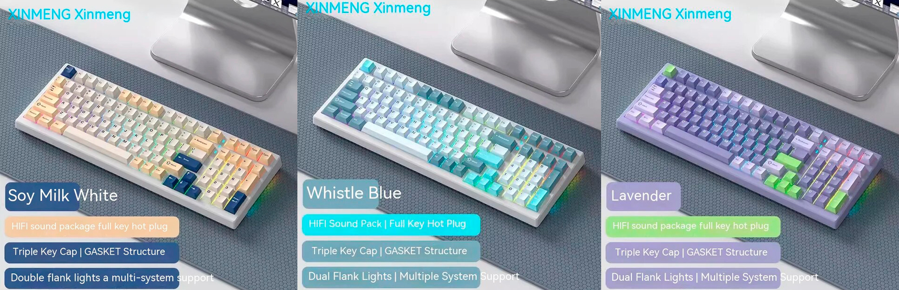

**Cпеки:**

- Материал корпуса: ABS пластик
- Количество клавиш: 99
- Тип крепления: gasket mount
- Плейт: поликарбонат
- Переключатели: Outemu White Jade
- Хотсвап: Kailh 3 & 5 pin
- Кейкапы: ОЕМ профиль, PBT
- Шумоизоляция: 5 слоев (включая PET)
- Подключение: Tri-mode (провод, 2.4ггц радиоканал, bluetooth)
- Подсветка: Есть
- Аккумулятор: 4600mAh
- Совместимость: MAC/Windows/IOS/Android
- Софт: Проприетарный

X98PRO очень напоминает M87PRO, только в большем лейауте и с меньшим выбором по свичам в бюджете (версии с TTC стоят больше 7к, например). 

Также нет онли-провод варианта в продаже. Если есть возможность брать с озона то берем там, вернуть проще и цена ниже.

- актуальные ссылки на озон\али
    
    [https://ozon.ru/t/5jJzWBy](https://ozon.ru/t/5jJzWBy)
    
    [https://aliexpress.ru/item/1005006655437054.html?sku_id=12000037935455051&spm=a2g2w.productlist.search_results.0.61b65d30Oiz2Ql](https://aliexpress.ru/item/1005006655437054.html?sku_id=12000037935455051&spm=a2g2w.productlist.search_results.0.61b65d30Oiz2Ql)
    

### Aula F99

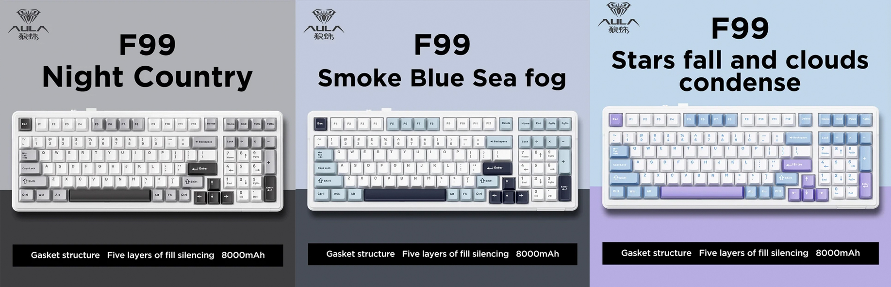

**Cпеки:**

- Материал корпуса: ABS пластик
- Количество клавиш: 99
- Тип крепления: gasket mount
- Плейт: поликарбонат
- Переключатели: Leobog Graywood V3 \ Leobog Reaper
- Хотсвап: Kailh 3 & 5 pin
- Кейкапы: ОЕМ профиль, PBT
- Шумоизоляция: 5 слоев (включая PET)
- Подключение: Tri-mode (провод, 2.4ггц радиоканал, bluetooth)
- Подсветка: Есть
- Аккумулятор: 8000mAh
- Совместимость: MAC/Windows/IOS/Android
- Софт: Проприетарный

Thocky саунд, легкий намек на флекс, пластиковый корпус набитый доверху шумкой, тримод и свичи от Леобог в придачу.

Если кратко: как F75, только 98%.

- актуальные ссылки на озон\али
    
    [https://ozon.ru/t/daoVJQb](https://ozon.ru/t/daoVJQb)
    
    [https://aliexpress.ru/item/1005006159390484.html?srcSns=sns_Copy&businessType=ProductDetail&spreadType=socialShare&tt=MG&utm_medium=sharing&sku_id=12000038324926926](https://aliexpress.ru/item/1005006159390484.html?srcSns=sns_Copy&businessType=ProductDetail&spreadType=socialShare&tt=MG&utm_medium=sharing&sku_id=12000038324926926)
    

# Среднячки: 7-9**к₽**

## 65%

### Xinmeng M71, M67 & Yunzii AL71

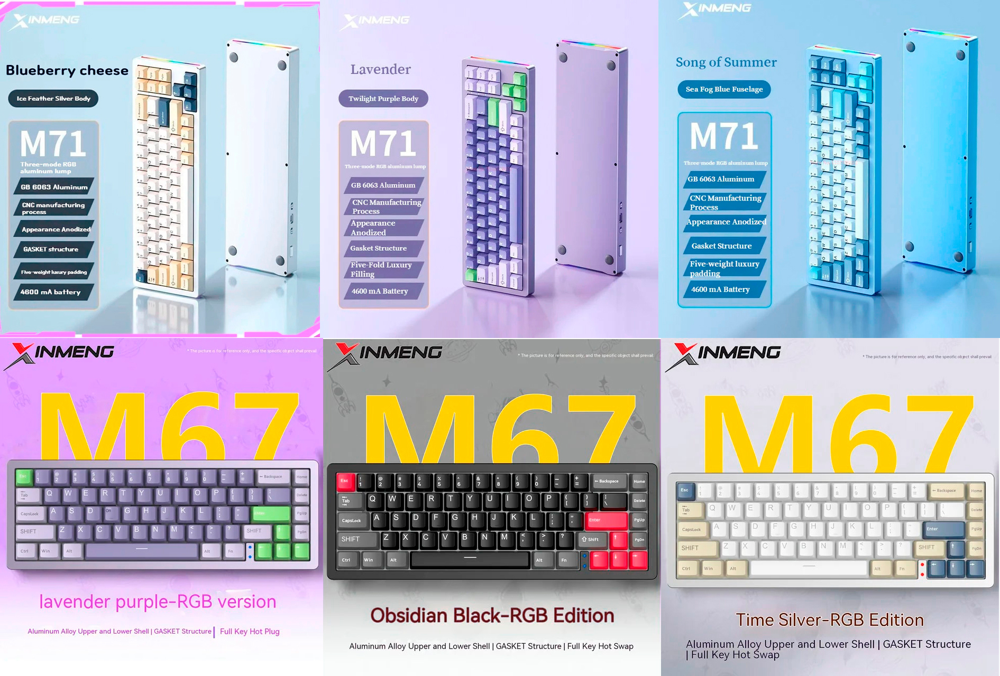

Xinmeng M71\M67

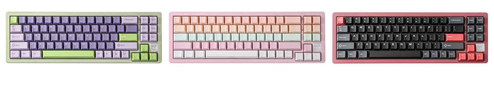

Yunzii AL71

**Спеки:**

- Материал корпуса: Алюминий
- Количество клавиш: 71\67
- Тип крепления: gasket mount
- Плейт: Поликарбонат
- Переключатели: Outemu White Jade
- Хотсвап: TTC, 3 & 5 pin
- Кейкапы: Cherry профиль, PBT
- Шумоизоляция: 5 слоев (Включая PET)
- Подключение: Tri-mode (провод, 2.4ггц радиоканал, bluetooth)
- Подсветка: Есть
- Аккумулятор: 4600 мАч
- Совместимость: MAC/Windows/IOS/Android
- Софт: Проприетарный

Да, M71 не 65%, но и в 75% засунуть ее нельзя, так что будет тут.

Пожалуй самая хайповая клава 2023-го года, настоящий прорыв в мире бюджетных клавиатур. Именно с нее пошел наплыв различных дешевых алю пребилдов из Китая, и понятно почему: за среднюю цену в 7500 русских рублей вы получаете 6063 анодированный алюминий, силиконовый гаскет маунт, толстые пбт черри кейкапы, три-мод, полный набор шумок и чуть смазанные “пойдет” длиннопипковые переключатели.

Стабилизаторы все еще не PCB-mount, но смазаны они вполне себе неплохо, с завода уже ничего не тикает.

Из минусов: возможен брак радиоканала, особенно это касается ранних батчей лета прошлого года.

Касательно M67: как М71, только шисятпятка.

Касательно Yunzii: тот же М71, только чуть другие расцветки на выбор и бейджик у стрелок 

- актуальные ссылки на озон\али
    
    M71:
    [https://ozon.ru/t/paD1R6l](https://ozon.ru/t/paD1R6l)
    [https://aliexpress.ru/item/1005006044841765.html?sku_id=12000035468571122&spm=a2g2w.productlist.search_results.1.2a832471LTdiRJ](https://aliexpress.ru/item/1005006044841765.html?sku_id=12000035468571122&spm=a2g2w.productlist.search_results.1.2a832471LTdiRJ)
    
    M67:
    
    на озоне нет 
    
    [https://aliexpress.ru/item/1005006202830971.html?sku_id=12000036253009423&spm=a2g2w.productlist.search_results.0.73724866V9X4ra](https://aliexpress.ru/item/1005006202830971.html?sku_id=12000036253009423&spm=a2g2w.productlist.search_results.0.73724866V9X4ra)
    
    AL71:
    
    [https://ozon.ru/t/pa0rMMK  (не выгодно)](https://ozon.ru/t/pa0rMMK) 
    
    [https://aliexpress.ru/item/1005006030477191.html?sku_id=12000035400220868&spm=a2g2w.productlist.search_results.1.2ea628efOpAZ5D](https://aliexpress.ru/item/1005006030477191.html?sku_id=12000035400220868&spm=a2g2w.productlist.search_results.1.2ea628efOpAZ5D)
    

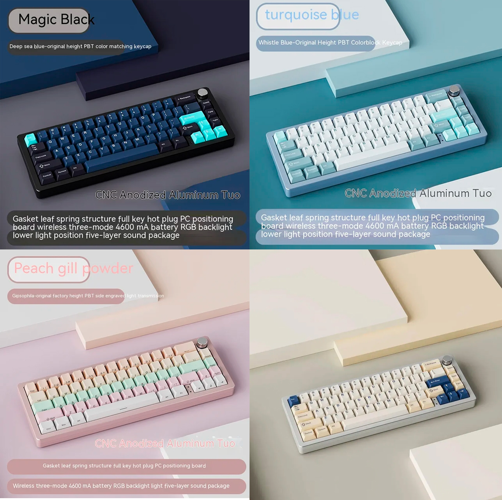

Xinmeng A66

### Xinmeng A66, Yunzii AL66

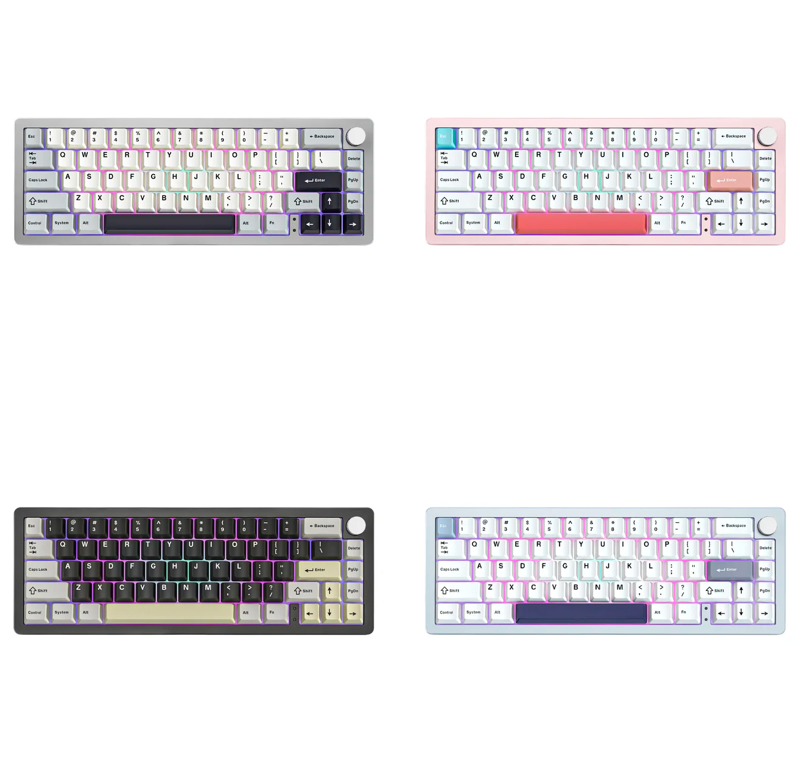

Yunzii AL66

**Спеки:**

- Материал корпуса: Алюминий
- Количество клавиш: 65
- Тип крепления: gasket mount
- Плейт: Поликарбонат
- Переключатели: Xinmeng Ebony (Dark Plum) \ TTC Steel Superman \ Yunzii Milk
- Хотсвап: TTC, 3 & 5 pin
- Кейкапы: Cherry профиль, PBT
- Цвета: серебро, фиолетовый, черный.
- Шумоизоляция: 5 слоев (Включая PET)
- Подключение: Tri-mode (провод, 2.4ггц радиоканал, bluetooth)
- Подсветка: Есть
- Аккумулятор: 4600 мАч
- Совместимость: MAC/Windows/IOS/Android
- Софт: Проприетарный

Клавиатуры являются по сути альтернативной версией M67, только с крутилкой.

В свою очередь, отличия AL66 от A66: у Yunzii только Milk переключатели, когда у Xinmeng на выбор Dark Plum и Steel Superman, чуть другой выбор расцветок, а также присутствие пластиковой RGB вставки на боку клавиатуры.

Касательно переключателей - из трех представленных на выбор круче всех TTC Steel Superman, я бы взял их. Крайне приятные свичезы на мой ([и не только](https://t.me/mechroomnews/712)) взгляд.

- актуальные ссылки на озон\али
    
    A66:
    
    [https://ozon.ru/t/NPynq40](https://ozon.ru/t/NPynq40)
    
    [https://aliexpress.ru/item/1005006756780170.html?sku_id=12000038200312477&spm=a2g2w.productlist.search_results.1.5cd94b7ap4Ud0i](https://aliexpress.ru/item/1005006756780170.html?sku_id=12000038200312477&spm=a2g2w.productlist.search_results.1.5cd94b7ap4Ud0i)
    
    AL66:
    
    [https://ozon.ru/t/jZ8Qg3k](https://ozon.ru/t/jZ8Qg3k)
    
    [https://aliexpress.ru/item/1005006142912280.html?sku_id=12000035953104417&spm=a2g2w.productlist.search_results.1.86c03526d50gba](https://aliexpress.ru/item/1005006142912280.html?sku_id=12000035953104417&spm=a2g2w.productlist.search_results.1.86c03526d50gba)
    

## 75% - Leobog Hi75

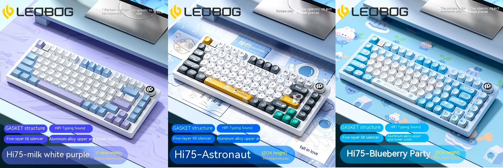

больше расцветок можно посмотреть по ссылке на Aliexpress

**Cпеки:**

- Материал корпуса: Алюминий
- Количество клавиш: 81
- Тип крепления: gasket mount
- Плейт: Полипропилен
- Переключатели: Leobog GrayWood V3, Leobog IceBlue, Leobog Nimbus V3, Leobog Juggle V2
- Хотсвап: 3 & 5 pin
- Кейкапы: MOA\MDA профиль, PBT
- Шумоизоляция: 5 слоев (Включая PET)
- Подключение: Только проводное (Wired)
- Подсветка: Есть
- Совместимость: MAC/Windows
- Софт: Проприетарный

Неплохая семесятпятка которая сильно хайпилась осенью 2023 года.

Тут у нас ооочень мягкий полипропиленовый плейт, тонкая плата с флекс-катами, пять слоев шумки, крутилка и неплохие переключатели, присутствуют даже тактилки (Leobog Juggle V2).

Полипропиленовый плейт является плюсом, но в это же время и минусом этой клавиатуры, так как вставить первые десять-пятнадцать свичей без поддевания плейта не представляется возможным. Из минусов еще можно выделить достаточно тонкий алюминий и powder-coat, но подобные удешевления материалов в целом никак не влияют на конечное впечатление от продукта.

Софт от производителя, VIA не завезли, PCB-mount стабилизаторов тоже.

Но нельзя забывать о ее цене, смотря на которую становится понятно что минусы вполне себе ожидаемы.

Если кого то раздражает крутилка с лого Leobog, то вот вам ссылка на вставку для её замены:

[https://aliexpress.ru/item/1005006126031142.html?sku_id=12000035871205715&spm=.search_results.7.30b25adcktSDDm](https://aliexpress.ru/item/1005006126031142.html?sku_id=12000035871205715&spm=.search_results.7.30b25adcktSDDm)

- актуальные ссылки на озон\али:
    
    [https://ozon.ru/t/V4J1ZlL](https://ozon.ru/t/V4J1ZlL)
    
    [https://aliexpress.ru/item/1005006623579868.html?sku_id=12000037852492524&spm=.search_results.2.30b25adcktSDDm](https://aliexpress.ru/item/1005006623579868.html?sku_id=12000037852492524&spm=.search_results.2.30b25adcktSDDm)
    

## 80% (TKL)

Клавиатуры формфактора TKL и больше в сущности ничем не отличаются от тех что представлены в “Низы”, так что либо докидываем до того что в “Топы”, либо со спокойной душой покупаем “Низы” 

# Топы: 9-15**к₽**

## 60% - Keychron V4

                                                         Frosted & Carbon 

**Cпеки:**

- Материал корпуса: ABS пластик
- Количество клавиш: 60
- Тип крепления: tray mount
- Плейт: Сталь
- Переключатели: Keychron K Pro Red\Blue\Brown
- Хотсвап: Kailh 3 & 5 pin
- Кейкапы: OSA профиль, PBT
- Шумоизоляция: 2 слоя
- Подключение: Только проводное (Wired)
- Подсветка: Есть
- Совместимость: MAC/Windows
- Софт: VIA

Первая и последняя шисятка в гайде.

Ну что сказать, это база, так называемый Кейчччрон.

У клавиатуры стальной плейт, трей маунт и солидный шмат силикона на дне, который неплохо заполняет пустой, но качественный пластиковый корпус.

На борту VIA (наконец!!), нормальные PCB стабилизаторы с завода и легендарные даблшот пбт OSA капы.

OSA имеют высоту как у OEM, но впуклость как у SA, отсюда и название.

Касательно свичей - на выбор у нас красные (линейные), синие (кликающие) и коричневые (тактильные) коммутаторы, которые по сути являются реколором Gateron Red, Blue и Brown соответственно.

Да, свичезы скучные. Но в целом - приемлимо, ничего плохого про них сказать нельзя.

Оверолл клавиатура хорошая, и если хочется что нибудь маленькое то V4 вполне себе хороший выбор, брать можно.

- актуальные ссылки на озон\али
    
    на озоне ее нет :(
    
    [https://aliexpress.ru/item/1005004813349680.html?sku_id=12000030589198220&spm=a2g2w.productlist.search_results.0.20db7db7TFqiTV](https://aliexpress.ru/item/1005004813349680.html?sku_id=12000030589198220&spm=a2g2w.productlist.search_results.0.20db7db7TFqiTV)
    

## 65% - Cidoo V65

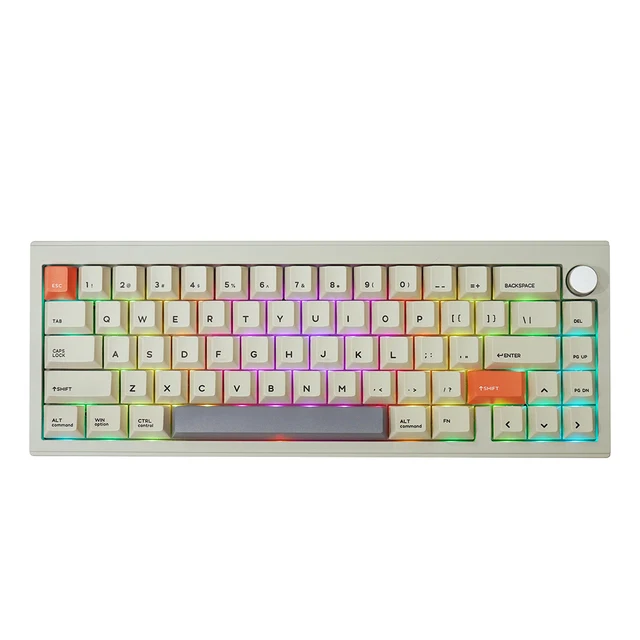

**Cпеки:**

- Материал корпуса: Алюминий
- Количество клавиш: 66
- Тип крепления: gasket mount
- Плейт: Поликарбонат
- Переключатели: Quark Quake Matte
- Хотсвап: Kailh 3 & 5 pin
- Кейкапы: Cherry профиль, PBT
- Шумоизоляция: 3 слоя
- Подключение: Провод\Bluetooth
- Емкость аккумулятора: 3000мАч
- Подсветка: Есть
- Совместимость: MAC/Windows/IOS/Android
- Софт: VIA

Шисятпятка с неким ретро-вайбом.

VIA, бодрые линейные переключатели с Haimu мануфактурингом, поддержка PCB-Mount стабилизаторов, толстые пбт дайсаб капы, порон гаскет маунт и 1.3кг веса в сборе.

Клавиатура не ведрирует даже если вытащить шумку, алюминий достаточно толстый.

Покрашена песком, слегка шершавая на ощупь.

- актуальные ссылки на озон\али
    
    [https://ozon.ru/t/Ne68pKA](https://ozon.ru/t/Ne68pKA)
    
    [https://aliexpress.ru/item/1005004841731277.html?sku_id=12000033291462858&spm=a2g2w.productlist.search_results.0.1a714f75OCaVMu](https://aliexpress.ru/item/1005004841731277.html?sku_id=12000033291462858&spm=a2g2w.productlist.search_results.0.1a714f75OCaVMu) 
    

## 75%

### VGN VXE75

**Cпеки:**

- Материал корпуса: Алюминий
- Количество клавиш: 82
- Тип крепления: gasket mount
- Плейт: Поликарбонат\FR4
- Переключатели: Kailh BOX Iceberry Cream PRO \ VGN Ania
- Хотсвап: 3 & 5 pin
- Кейкапы: OEM профиль, PBT
- Шумоизоляция: 5 слоев (Включая PET)
- Подключение: Tri-Mode
- Емкость аккумулятора: 3000\6000 мАч
- Подсветка: Есть
- Совместимость: MAC/Windows/IOS/Android
- Софт: Проприетарный

Солидная алюминиевая семесятпятка с претензией на премиум. Толстые пбт капы, порон гаскет маунт, приятный на ощупь анод\электрофорез, здравый выбор переключателей.

Клава без VIA, но их VGN HUB вполне себе можно использовать, рвотного рефлекса он не вызывает.

Поддержки PCB-Mount стабилизаторов нет, в стоке идут адекватные плейт-маунт.

Также у этой борды есть фишка - F13 модуль в правом верхнем углу клавиатуры может быть не только кнопкой, но и хотсвап энкодером или бейджем-заглушкой.

На выбор пять расцветок:

- Зеленый анод
- Черный анод
- Серебристый анод
- Белый электрофорез
- Фиолетовый электрофорез

Стоит отметить отличия самой дешевой версии – серебряной (цена стартует от 9300 вечнодеревянных) от остальных.

У серябряной версии:

- Нет PVD-веса, вместо него обычный анодированный
- Поликарбонатный плейт
- Аккумулятор на 3000мАч вместо 6000
- Только Ania свитчи

Но даже серебряная версия - отличная покупка за свои деньги 

- актуальные ссылки на озон\али:
    
    [https://ozon.ru/t/86l57qr](https://ozon.ru/t/86l57qr)
    
    [https://ozon.ru/t/RZn9qQ5](https://ozon.ru/t/RZn9qQ5)
    
    [https://aliexpress.ru/item/1005006031842264.html?sku_id=12000037188249282&spm=a2g2w.productlist.search_results.0.64ef3109FAyZax](https://aliexpress.ru/item/1005006031842264.html?sku_id=12000037188249282&spm=a2g2w.productlist.search_results.0.64ef3109FAyZax)
    

### WOBKEY Rainy75

**Cпеки:**

- Материал корпуса: Алюминий
- Количество клавиш: 83
- Тип крепления: gasket mount
- Плейт: Полипропилен\FR4
- Переключатели: HMX Violet \ JWK Wob
- Хотсвап: 3 & 5 pin
- Кейкапы: Cherry профиль, PBT
- Шумоизоляция: 5 слоев (Включая PET)
- Подключение: Tri-Mode
- Емкость аккумулятора: 3500\7000 мАч
- Подсветка: зависит от выбранной конфигурации
- Совместимость: MAC/Windows/IOS/Android
- Софт: VIA

Так называемый Дождливо75 является идеальным воплощением бюджетной клавиатуры.

Тут у нас VIA, возможность беспроводного подключения, PCB гаскет маунт на силиконовых сосках, неплохие гладкие пбт капы, хорошие свичи от известных мануфактуреров, поддержка PCB-Mount стабилизаторов, разные плейты на выбор, всевозможные шумки, внушительный вес (2кг) и это все стартует с 10.5к₽.

Момент который чаще всего вызывает вопросы - деление на Lite, Standart и PRO версии.

Отличия можете наблюдать на пикче ниже:

- актуальные ссылки на озон\али:
    
    на озоне ее нет :(
    
    [https://aliexpress.ru/item/1005006357881893.html?sku_id=12000038672861379&spm=a2g2w.productlist.search_results.0.74a9368aSaNWzx](https://aliexpress.ru/item/1005006357881893.html?sku_id=12000038672861379&spm=a2g2w.productlist.search_results.0.74a9368aSaNWzx)
    

### Swagkeys Bridge75

**Cпеки:**

- Материал корпуса: Алюминий
- Количество клавиш: 83
- Тип крепления: gasket mount
- Плейт: Поликарбонат\FR4
- Переключатели: MMD Princess
- Хотсвап: Kailh 3 & 5 pin
- Кейкапы: Cherry профиль, PBT
- Шумоизоляция: 5 слоев (Включая PET)
- Подключение: Tri-Mode
- Емкость аккумулятора: 4000\8000 мАч
- Подсветка: зависит от выбранной конфигурации
- Совместимость: MAC/Windows/IOS/Android
- Софт: VIA

Новинка конца апреля 2024 года.

Как следует из названия, клавиатуру позиционируют как мост между бюджетниками и премиумом. Борд имеет VIA, Тримод, популярные MMD Princess переключатели и систему быстрой разборки с помощью петель.

В стоке идут Plate-Mount, но есть поддержка PCB-Mount стабилизаторов.

Звучит вполне себе нормально даже без шумки, пинга нет.

Как и в случае с Rainy75, тут присутствует разделение на комплектации, существует даже магнитная версия.

По идее клавиатура должна сместить Rainy75 и стать новым бюджетным топом, но пока ее купило слишком мало людей и выводы делать рано.

- актуальные ссылки на али\озон
    
    на озоне ее нет :(
    
    [https://aliexpress.ru/item/1005006831498828.html?sku_id=12000038643881369](https://aliexpress.ru/item/1005006831498828.html?sku_id=12000038643881369)
    

### Cidoo V75

**Cпеки:**

- Материал корпуса: Алюминий
- Количество клавиш: 81
- Тип крепления: gasket mount
- Плейт: Поликарбонат
- Переключатели: Quark Quake Matte
- Хотсвап: Kailh 3 & 5 pin
- Кейкапы: Cherry профиль, PBT
- Шумоизоляция: 4 слоя
- Подключение: Tri-Mode
- Емкость аккумулятора: 3000 мАч
- Подсветка: Есть
- Совместимость: MAC/Windows/IOS/Android
- Софт: VIA

Клавиатура по сути является увеличенной версией Cidoo V65 (см. 65%), но имеет нормальные PCB-mount стабилизаторы в стоке и Tri-Mode.

Все что написано про V65 полностью применимо к этому борду.

- актуальные ссылки на озон\али
    
    [https://ozon.ru/t/bgGEMJN](https://ozon.ru/t/bgGEMJN)
    
    [https://aliexpress.ru/item/1005005447510399.html?sku_id=12000033119059224&spm=a2g2w.productlist.search_results.0.5ce443c9B6kuRb](https://aliexpress.ru/item/1005005447510399.html?sku_id=12000033119059224&spm=a2g2w.productlist.search_results.0.5ce443c9B6kuRb)
    

### CHILLKEY ND75

**Cпеки:**

- Материал корпуса: Алюминий
- Количество клавиш: 82
- Тип крепления: top mount \ silicagel partcle \ split O-Ring
- Плейт: Поликарбонат
- Переключатели: Gateron EF Dopamine Blue
- Хотсвап: 3 & 5 pin
- Кейкапы: Cherry профиль, PBT
- Шумоизоляция: 5 слоев (Включая PET)
- Подключение: Tri-Mode
- Емкость аккумулятора: 3600 мАч
- Подсветка: Есть
- Совместимость: MAC/Windows/IOS/Android
- Софт: Проприетарный

На ваших экранах ND75, 75-ти процентная клавиатура от гениев китайской клавиатурной мысли из CHILLKEY (создатели Paw65).

Три типа маунта, беспровод, свичи от Gateron, пер-кей RGB, крепление топа к боттому с помощью дверных петель как и ЭКРАН.

Вес из алюминия, но за такую цену - хорошо что он хотя бы есть.

Из минусов: в стоке идут Plate-Mount стабилизаторы и нет VIA.

## 80% (TKL)

### Cidoo V87

**Cпеки:** 

- Материал корпуса: Алюминий
- Количество клавиш: 87
- Тип крепления: gasket mount
- Плейт: Поликарбонат
- Переключатели: Quark Quake Matte
- Хотсвап: Kailh 3 & 5 pin
- Кейкапы: Cherry профиль, PBT
- Шумоизоляция: 4 слоя
- Подключение: Tri-Mode
- Емкость аккумулятора: 3000 мАч
- Подсветка: Есть
- Совместимость: MAC/Windows/IOS/Android
- Софт: VIA

Клавиатура по сути является увеличенной версией Cidoo V65 (см. 65%), но имеет нормальные PCB-mount стабилизаторы в стоке и Tri-Mode.

Все что написано про V65 полностью применимо к этому борду.

- актуальные ссылки на озон\али
    
    [https://ozon.ru/t/3N5ED1P](https://ozon.ru/t/3N5ED1P)
    
    [https://aliexpress.ru/item/1005005625009734.html?sku_id=12000033790632374&spm=a2g2w.productlist.search_results.0.5ce443c9B6kuRb](https://aliexpress.ru/item/1005005625009734.html?sku_id=12000033790632374&spm=a2g2w.productlist.search_results.0.5ce443c9B6kuRb)
    

### Monsgeek M3W

**Cпеки:** 

- Материал корпуса: Алюминий
- Количество клавиш: 87
- Тип крепления: gasket mount
- Плейт: Поликарбонат
- Переключатели: AKKO V3 Cream Pro Yellow\Blue & Ice Cream Pink\Purple
- Хотсвап: 3 & 5 pin
- Кейкапы: OEM профиль, PBT
- Шумоизоляция: 3 слоя
- Подключение: Tri-Mode
- Емкость аккумулятора: 6000 мАч
- Подсветка: Есть
- Совместимость: MAC/Windows/IOS/Android
- Софт: Проприетарный

Вариант выше во всем лучше монсгика, но если по каким то причинам не устраивает Cidoo, то берем монсгик.

У нас тут все вполне обычные фишки бордов в этом ценовом сегменте: Три-Мод, достаточно широкий выбор переключателей в стоке (есть даже тактилки), Per-Key RGB подсветка и поддержка PCB-Mount стабилизаторов.

Без шумки клавиатура ведрирует, так что вынимать не рекомендую.

- актуальные ссылки на озон\али
    
    [https://ozon.ru/t/1VnkER1](https://ozon.ru/t/1VnkER1)
    
    [https://aliexpress.ru/item/1005006179572120.html?sku_id=12000036159664673&spm=a2g2w.productlist.search_results.0.59fc2beeoB6yUL](https://aliexpress.ru/item/1005006179572120.html?sku_id=12000036159664673&spm=a2g2w.productlist.search_results.0.59fc2beeoB6yUL)
    

## 96% (1800) - Ajazz AC100

**Cпеки:** 

- Материал корпуса: Алюминий
- Количество клавиш: 99
- Тип крепления: gasket mount
- Плейт: Поликарбонат\FR4
- Переключатели: Sea Salt \ Huano Gift \ Ice cream \ KTT Hyacinth
- Хотсвап: Kailh 3 & 5 pin
- Кейкапы: Cherry профиль, PBT
- Шумоизоляция: 5 слоев (Включая PET)
- Подключение: Провод \ Tri-Mode
- Емкость аккумулятора: 4000 мАч
- Подсветка: в зависимости от конфигурации
- Совместимость: MAC/Windows/IOS/Android
- Софт: Проприетарный

Интересная попытка китайцев в пародию на QK100, аналогов которой в данном бюджете не существует, это все что нужно знать.

Клавиатура МАКСИМАЛЬНО добротная.

Из минусов можно выделить отсутствие поддержки PCB-Mount стабилизаторов и VIA.

Деление на “касты” имеется:

Подсветка, как и экран с плейтом, зависят от выбранной конфигурации. Она может быть как одноцветная или RGB, так и отсутствовать вовсе.

- актуальные ссылки на озон\али
    
    на озоне ее нет :(
    
    [https://aliexpress.ru/item/1005006639389729.html?sku_id=12000037897467001&spm=a2g2w.productlist.search_results.0.59fc2beeoB6yUL](https://aliexpress.ru/item/1005006639389729.html?sku_id=12000037897467001&spm=a2g2w.productlist.search_results.0.59fc2beeoB6yUL)
    

## 100% - Keychron V6

**Cпеки:** 

- Материал корпуса: ABS пластик
- Количество клавиш: 108
- Тип крепления: Tray mount
- Плейт: Сталь
- Переключатели: Keychron K Pro Brown\Red
- Хотсвап: Kailh 3 & 5 pin
- Кейкапы: OSA профиль, PBT
- Шумоизоляция: 3 слоя
- Подключение: Провод
- Подсветка: есть
- Совместимость: MAC/Windows
- Софт: VIA

Вполне себе адекватный вариант полноразмерной (не 1800!!!) клавиатуры в бюджете
По сути является увеличенной версией Keychron V4, значит и всё что сказано про V4 (см. 60%), здесь актуально.

- актуальные ссылки на озон\али:
    
    [https://ozon.ru/t/Ye8awWY](https://ozon.ru/t/Ye8awWY)
    
    [https://aliexpress.ru/item/1005006151338320.html?sku_id=12000036074312184&spm=a2g2w.productlist.search_results.0.487824b63e9Mn4](https://aliexpress.ru/item/1005006151338320.html?sku_id=12000036074312184&spm=a2g2w.productlist.search_results.0.487824b63e9Mn4)