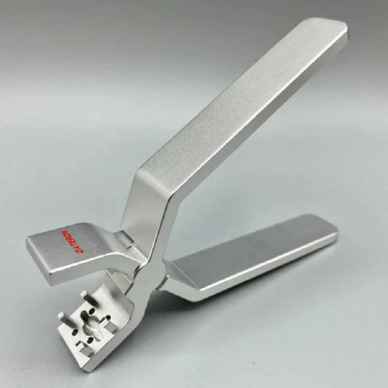

# Инструменты для смазки свичей

Owner: keebcult

### Открывашка свичей либо свичекол (он гораздо удобнее и меньше вредит топу свича при открывании, но стоит дороже)

Gateron Switch Opener (свичекол) - [aliexpress](https://aliexpress.ru/item/1005003918645159.html), [divinikey](https://divinikey.com/collections/keyboard-tools/products/gateron-switch-opener)

Обычная открывашка (switch opener) выглядит так:

### Кисть либо микробраш

Плоская кисть небольшой ширины (0, 1)

Standard - Liner #0 (1.5mm) - [divinikey](https://divinikey.com/collections/keyboard-tools/products/divinikey-brush?variant=32067923836993)

### Stem holder/picker

Лучший вариант - хваталка в виде цангового карандаша. Для свичей нужна версия на 4мм, имейте ввиду.

… но можно и такую (ее чуть проще найти)

### (опционально) lube-station

WuqueStudio Lube Station - [aliexpress](https://aliexpress.ru/item/1005004595288106.html?gatewayAdapt=glo2rus&sku_id=12000030868825226), [divinikey](https://divinikey.com/products/wuque-silicone-lube-station)

