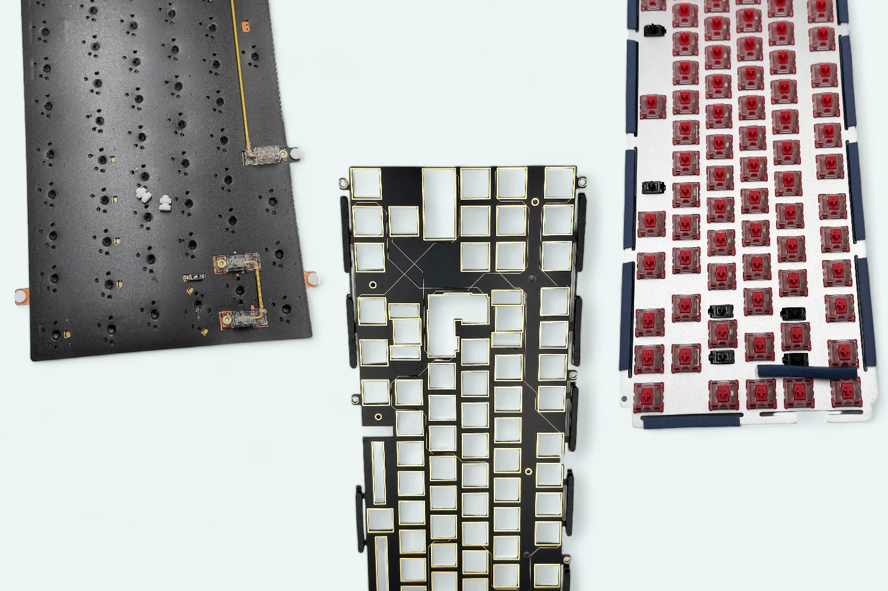

# Коротко о маунтах и их особенностях

Owner: keebcult

автор: [@ForgottenHunter](https://t.me/ForgottenHunter)

источник: [sacredkeebs.com](https://www.sacredkeebs.com/blog/korotko-pro-maunti-ta-yih-osoblivosti)

**Предисловие**

Каждую публикацию я сталкиваюсь с необходимостью делать ремарки о том или ином маунте, но некоторую информацию достаточно трудно уместить в пару предложений без пояснений и картинок.

Поэтому сегодняшняя публикация будет посвящена маунтам, которые так или иначе встречаются в современных механических клавиатурах.

Попробую описать всё максимально просто и доступно, без духоты и лишних подробностей

# Gasket Mount

Самый распространённый вариант маунта на сегодняшний день.

Гаскеты (прокладки) встречаются в огромном количестве разных вариантов: Прокладки из поролона, силиконовые вставки, резиновые "носочки" или продольные прокладки и т. д.

QK75N gasket pins / Matrix 8XV3.0 poron gaskets / Zoom75 gasket strips

Создаётся впечатление, что минимум раз в день появляется новая интерпретация гаскет маунта, но основная идея остается неизменной:

Прокладки (гаскеты) устанавливаются на специальные "уши" (посадочные места), а сами посадочные места зажимаются между половинками корпуса.

За счёт этого вибрации от сэндвича из PCB и плейта не передаются в корпус и как бы «изолируются», лишая клавиатуру "паразитных" призвуков, передающихся через вибрации.

Маунт может быть как достаточно жёстким, так и очень мягким, в зависимости от вида самих прокладок и конструкции самой клавиатуры.

Из-за относительной простоты реализации и конструкции, которая "прощает" много недочетов при сборке, Gasket Mount встречается на клавиатурах любого ценового сегмента, от бюджетных, до самых дорогих.

# Tray mount

Маунт, который можно встретить в огромном количестве бюджетных клавиатур формата 60% и не только.

PCB крепится винтами к посадочным местам/стойкам на дне клавиатуры.

Tofu 60 tray mount case

Благодаря универсальному расположению стоек многие 60% PCB и корпуса с tray mount являются взаимозаменяемыми.

Тот же Wooting 60HE использует tray mount, благодаря чему можно перекинуть PCB от 60HE в сторонний 60% корпус с поддержкой tray mount.

Маунт очень жёсткий, что является плюсом для магнитных клавиатур, но не особо приятно при классических сборках.

Из-за передачи вибраций через стойки, звук выходит достаточно посредственным.

Еще одним минусом tray mount является плохая консистентность. Звук и ощущения сильно меняются в зависимости от расстояния до точек крепления.

Чтобы немного нивелировать жёсткость и погасить вибрации, используют разные вариации tray mount.

От надевания резиновых колец на болты (burger mount) до серьёзных изменений в конструкции, как в той же клавиатуре Salvation:

Wilba.Tech Salvation case

Вместо обычных стоек болты вкручиваются в специальные силиконовые стойки, что обеспечивает дополнительную изоляцию и мягкость благодаря лиф-спрингам из FR4.

# Top Mount

Этот своеобразный маунт был достаточно популярен в прошлом, а сейчас чаще всего встречается в премиальных клавиатурах, как правило, TKL формата.

Сэндвич из PCB и плейта крепится винтами к верхней рамке клавиатуры.

Glare TKL case

Из-за того, что верхняя рамка достаточно тонкая, а сэндвич из PCB и плейта крепится к ней напрямую, вибрации очень сильно передаются на тонкую верхнюю рамку. Это приводит к более объёмному звуку с присутствием реверберации, часто сопровождаемому звуком пустоты (hollow sound).

Звук Top Mount имеет свой шарм, но достаточно сложен в конфигурировании и получении приятной тональности.

Из-за фиксации к верхней рамке, тайпинг на Top Mount ощущается достаточно жёстким.
Впрочем, мягкие плейты (PC/POM/PP) и более тонкие PCB (1.2 мм толщины, вместо стандартных 1.6 мм), могут скорректировать эту особенность.

В некоторых клавиатурах (например, Matrix 8XV3.0) на места закручивания болтов надевают резиновые прокладки, чтобы сгладить вибрации и сделать тайпинг чуть мягче.

Matrix 8XV3.0 steel plate

По моему мнению, это убивает все особенности и изюминки данного маунта.

Да, звук становится чище, но лишается характерного гула и объема, за который так любят Top Mount, и делает его более схожим с Gasket Mount в плане звука.

# O-Ring Mount (он же Unikorn mount)

Маунт, который обрел большую популярность благодаря одноименной клавиатуре — TGR x Singa Unikorn.

Вокруг сэндвича из PCB и плейта обернут о-ринг, который фиксирует конструкцию внутри корпуса благодаря трению.

Kalam Unikorn Plate with O-ring

O-Ring поглощает часть вибраций и делает тайпинг мягче.

Важный нюанс — кольца для o-ring маунта стандартного размера работают только с clip-in стабилизаторами (теми же TX).

Стойки в screw-in стабилизаторах слишком сильно торчат и не позволяют правильно уложить o-ring в посадочное место.

# Leaf Spring Mount

Не самый распространённый, но достаточно интересный вариант крепления, который активно продвигает студия Owlab, а с недавних пор студия Angry Miao также начала активно использовать этот маунт в своих продуктах.

В данном маунте сэндвич из PCB и плейта ложится на специальные ножки (лифы), которые пружинят и прогибаются при нажатии.

AM CyberBoard 4 / Owlab Jelly Evolv

Маунт очень мягкий, звучит чисто и обеспечивает достаточно равномерный тайп-фил.

## Частенько Leaf Spring маунт путают с Leaf Spring плейтами

Для примера можем рассмотреть такие модели, как F1-8X и F2-84 от Geon.
Многие по ошибке пишут, что в этих клавиатурах используется Leaf Spring маунт, но на самом деле в них используется Gasket O-Ring маунт с Leaf Spring плейтами.

Geon F2-84

Как вы можете видеть, это вариация Gasket Mount, только в качестве прокладок используется O-Ring.

В свою очередь Leaf Spring`и на плейте — посадочные места, которые контактируют с прокладками.

Они ощутимо прогибаются при нажатии, добавляя конструкции больше мягкости.

F2-84 Half FR4 plate

# Plateless Mount

Один из самых старых маунтов, использующихся в старых клавиатурах, который снова набирает большую популярность последние пару лет.

Как следует из названия, в данном маунте не используется плейт — PCB фиксируется в корпусе самостоятельно.

Neo Ergo Plateless gasket mount

Вариантов фиксации PCB - множество.

PCB может прикручиваться к топу/боттому, могут использоваться гаскеты, стойки и другие варианты креплений.

Отличительной чертой данного маунта является очень мягкий тайпинг и тонкий звук.
Большинство новичков не в восторге от подобного звучания клавиатуры, но часть энтузиастов наоборот считают Plateless эталонным вариантом "чистого" звучания клавиатуры.

Также стоит упомянуть несколько менее используемых вариантов маунтов:

# Integrated Plate Mount

Разновидность маунта, в котором верхняя рамка (топ) и плейт (в который мы вставляем свитчи) выполнены цельным элементом.

Idobao ID80 case

В этом варианте маунта всё звенит, вибрирует и ощущается очень жёстким.

# Sandwich Mount

Маунт, в котором плейт является полноценным элементом корпуса. Боттом, плейт и топ стягиваются между собой болтами.

Prelude 40%

Тайпинг жёсткий, звук достаточно грязный, но некоторым энтузиастам нравится тональность, которая получается при использовании данного маунта.