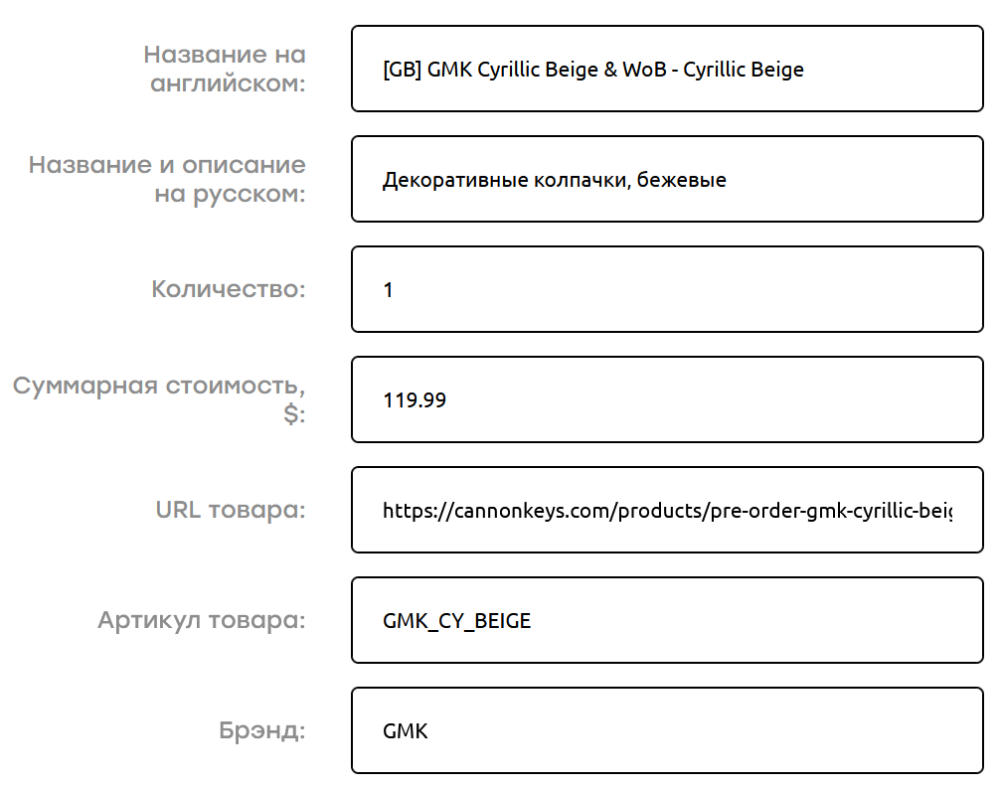

# Магазины и доставки

Owner: keebcult

<aside>
⚠️ Администрация не несет ответственности за работу магазинов и сервисов.

</aside>

---

# Чем возить из-за рубежа

## Проверенные mail-forwarding сервисы

- [prostobox.com](https://prostobox.com/?partner=1010836) (партнерская ссылка, которая дает 10% скидки на доставку)
- [shopfans.com](https://shopfans.ru/)

При заказе через шопфанс выбирайте “через Ташкент”, иначе есть шанс, что ваша посылка с клавиатурными штуками может застрять на финской таможне (и никогда ее не покинуть).

Я рекомендую возить простобоксом, т.к. он дешевле шопфанса почти в два раза и я не знаю ни одной причины, зачем нужно переплачивать.

Простобокс доставляет товары по России с помощью 5post, шопфанс - через боксберри.

## Как заполнять таможенную декларацию

Кейкапы - “декоративные колпачки”

Свичи - “кнопки для клавиатуры, комплект *шт.”

- Примеры моих деклараций
    
    
    

## Китайская барахолка

Фиш / Сианью / рыба / гоофиш: [https://www.goofish.com](https://www.goofish.com/)

Мобильные приложения: [Android](https://play.google.com/store/apps/details?id=com.taobao.idlefish) / [iOS](https://apps.apple.com/app/id510909506)

## Американская барахолка

[https://www.reddit.com/r/mechmarket/](https://www.reddit.com/r/mechmarket/)

[https://keebsforall.com/](https://keebsforall.com/)

# Вендоры, магазины и дизайнеры

**Документ с оценками надежности вендоров от модераторов r/mechmarket (и не только):**

[https://docs.google.com/document/d/1CtofbAoSlCigWGujk-O_cZNFJFfbS_8J1TVqLbO4W7I/edit#heading=h.dwgus7rrc0e9](https://docs.google.com/document/d/1CtofbAoSlCigWGujk-O_cZNFJFfbS_8J1TVqLbO4W7I/edit#heading=h.dwgus7rrc0e9)

Статья, в которой я ругаю и хвалю GMK:

[GMK – дуализм кейкапной природы](GMK%20%E2%80%93%20%D0%B4%D1%83%D0%B0%D0%BB%D0%B8%D0%B7%D0%BC%20%D0%BA%D0%B5%D0%B9%D0%BA%D0%B0%D0%BF%D0%BD%D0%BE%D0%B9%20%D0%BF%D1%80%D0%B8%D1%80%D0%BE%D0%B4%D1%8B%2083984d9241c2446d9a465a5053bdab02.md) 

## Хорошие

[novelkeys.com](http://novelkeys.com)

[cannonkeys.com](http://cannonkeys.com)

[omnitype.com](http://omnitype.com)

[divinikey.com](http://divinikey.com)

[mekibo.com](http://mekibo.com)

[geon.works](http://geon.works)

## Средние

[[kbdfans.com](http://kbdfans.com)](Магазины и доставки/kbdfans%20com%20384abaeabcdb4fc6aef3c3b2ea841eeb.md)

[keycult.com](http://keycult.com) (проблемы с QC)

[klc-playground.com](https://klc-playground.com/) (сомнительное QC клавиатур от Lin, плохие условия по обмену неудачных экземпляров SINGAKBD Kohaku)

## Плохие

[https://candykeys.com/](https://candykeys.com/)

[https://mechsandco.com/](https://mechsandco.com/)

[http://melgeek.com/](http://melgeek.com/)

[https://vala.supply/](https://vala.supply/)

[mykeyboard.eu](http://mykeyboard.eu) (магазин заявил о банкротстве и прекратил работу)

[rama.works](http://rama.works) (проблемы с QC и сроками)

[noxary.com](http://noxary.com) (дизайнер решил выйти из хобби, предварительно собрав много денег)

[meletrix](Магазины и доставки/meletrix%205c2f85dadf604e2db56f9b53eec53c14.md)

[loobedswitches.com](http://loobedswitches.com)

Mposible (куча людей не получили своих клавиатур, связи нет); [ссылка на чат пострадавших](https://t.me/mposible_fans)

Gvalchca (проблемы с QC, нулевая поддержка после продаж)

---

# Магазины людей из комьюнити

SoftKeebs - магазин от Skimo, [tg](https://t.me/SoftKeebs) / [avito](https://clck.ru/3Eqh3k)

SwitchJAM - [avito](https://www.avito.ru/sankt-peterburg/tovary_dlya_kompyutera/smazka_krytox_205g0_i_dr._vse_dlya_sborki_2181204639) / [vk](https://vk.com/switch_jam)

---

- Опыт продажи клавиатур за рубеж (от @qarmaa, 15.08.2023)
    
    Кстати, может кому интересно будет. Продал доску недавно, понадобилось ее отправить в США. Из России напрямую туда возит сейчас только Почта России, Боксберии и СДЭК не работают с электронными устройствами, даже если они не «вилочные», то есть не требуют  питания от сети. Видимо, перестраховываются. Знаю, что Б. везет транзитом через Бельгию, а вот С. хз через что.
    
    Решил отправить через знакомого из Армении. У них работает Фидекс, но прикол в том, что через своего авторизированного посредника. Загнули цену в 250 баксов за 3 кг. В итоге отправил Почтой Аримении по ускоренной программе за 130 баксов (это обычное ЕМС). Дошло за 10 дней до адресата.
    
    С. и Б. перестали работать с UPS на стороне США. Сейчас для доставки по стране там передают USPS.