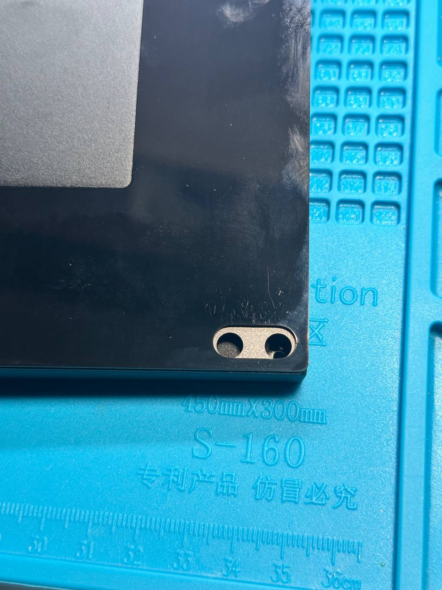

# meletrix

Owner: keebcult

# Контроль качества у Zoom

царапины, которые обнаружились после снятия заводской пленки, фото от @ForgottenHunter

# Отзыв @ForgottenHunter

Только с 3 или 4 ревизии они пофиксили плейт, который бился о болтик в 65

Качество покраски я молчу , в плане того, что оно от малейшего удара отверткой уже слазит

Зум ткл - контроль качества отсутствует
Ощущается и звучит он как кал.
Это в целом большая проблема зумов , у них Маунт и «внутрянка» - одинаковая на всех клавиатурах.
65 75 ткл , 98
Они все на одних всратых гаскетах.

Мульти-лейаут это конечно весело, но флипнутый слеш, который всегда стоит под углом слегка и флипнутый энтер в 65 - это пиздец

Отдельный пиздец это саппорт, его просто нет
Мне приехала ушатанная тклка, которую китаец обоссал и расцарапал внутри - мне сказали что это окей.

КФА (через которых я покупал) настолько охуели от ответа мелктрикс , что заплатили со своего кармана , сказали что это пиздец какой то

Недавний скандал с ребенком, который стоял и проверял качество покраски 75ток
Мне в принципе на детский труд пофиг, но хочется что бы клавиатуру проверял кто то более компетентный

Это так , из того что быстро могу вспомнить

# Использование детского труда

“Когда они запилили видос с завода , и тут же удалили
И сказали что это не ребенок, а очень молодо выглядящая сотрудница”