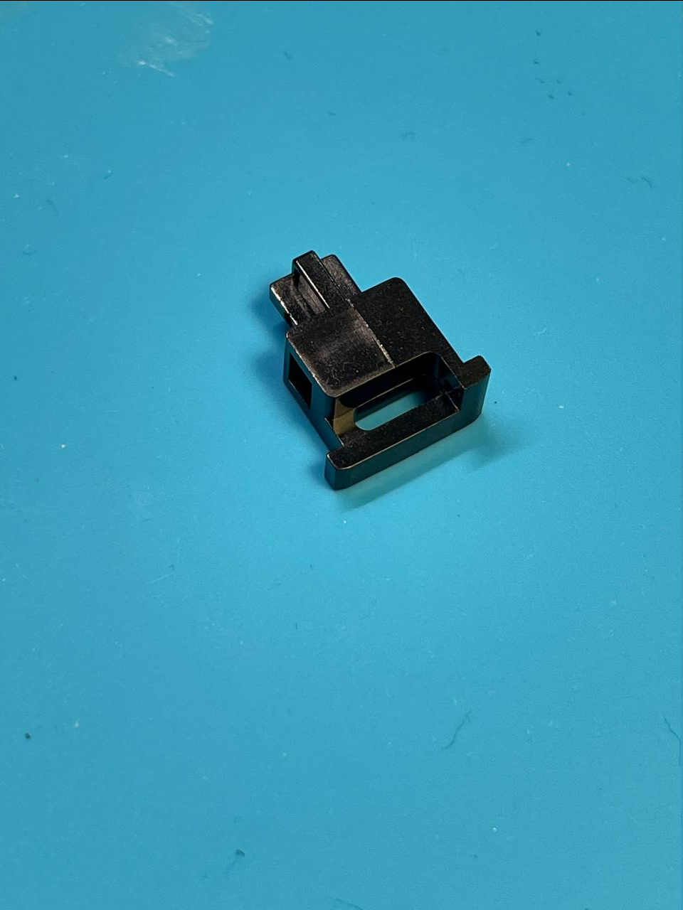

# На какие стабилизаторы стоит обратить внимание

Owner: keebcult

Если вы новичок — лучше обратите внимание на стабилизаторы с тесным хаузингом, от них проще добиться приемлемого результата.

### Стабилизаторы с тесным хаузингом

Хаузинги мазать Krytox 205g0, скобы — XHT-BDZ (либо 205g0).

Кривые 7u пробелы будут немного греметь в стабилизаторах с тесным хаузингом.

- TX AP (rev.4) - тесный хаузинг, рекомендуется смазывать XHT-BDZ
- Staebies
- Typeplus x YiKB Screw-in stabilizer (официальный [гайд по смазке](https://www.notion.so/19c0dd7101b780c2b357e6591cbc14b1?pvs=21))

### Стабилизаторы со свободным хаузингом

Их лучше смазывать с помощью шприца (заливать некоторое количество dielectric greese либо 205g0 внутрь стема).

- TX rev.3
- Owlstab v2
- C³ Equalz
- Durock v2 (вместо шприца можно сделать [holee-mod](https://www.youtube.com/watch?v=-vhpHjlkRgQ))

### Отзыв @ksotnikov на стабилизаторы от Typeplus

Ну что, пощупал данные стабилизаторы.
Репутация ТХ AP под угрозой, если они покажут себя на длительной дистанции также хорошо и не будет сваливаться смазка в силу конструкции стема и скобы.
Тестирование проводил c 205g0 + XHT-BDZ. (205g0 стем + хаузинг) (BDZ: wire)

Плюсы:

1. Данным стабам пофигу насколько скоба ровная, просто повертев стаб на ровной поверхности достаточно выбрать сторону поровнее.
2. Дешевые - $15.00
3. Воблинг кейкапа по вертикали на длинных клавишах чуть меньше чем на TX AP.
4. Можно смазать только 205g0 и будет очень даже неплохо.
5. Впервые при использовании BDZ у меня его уходит меньше, чем 205g0. У скобы мазать BDZ надо только кончики загнутые друг на друга.

Минусы:

1. Вставлять кривую скобу надо аккуратно, особенно если используется XHT-BDZ (засрать стенки будет очень легко без должной сноровки).
2. Пока что есть только Screw-in версия.
3. Воблинг кейкапа по вертикали на коротких клавишах чуть больше чем на TX AP.
4. Стемы как и хаузинги не симметричные. Надо подбирать зеркальную пару. Можно немного запутаться, но собрав в первый раз "на сухую" получится понять что к чему.
5. Толщина проволоки своя (тоньше), форма тоже, придется пользоваться только комплектными вайрами.

[https://www.youtube.com/watch?v=OWUji1yGbtE](https://www.youtube.com/watch?v=OWUji1yGbtE)
Выше ссылка на тезку, который уже запилил обзорчик