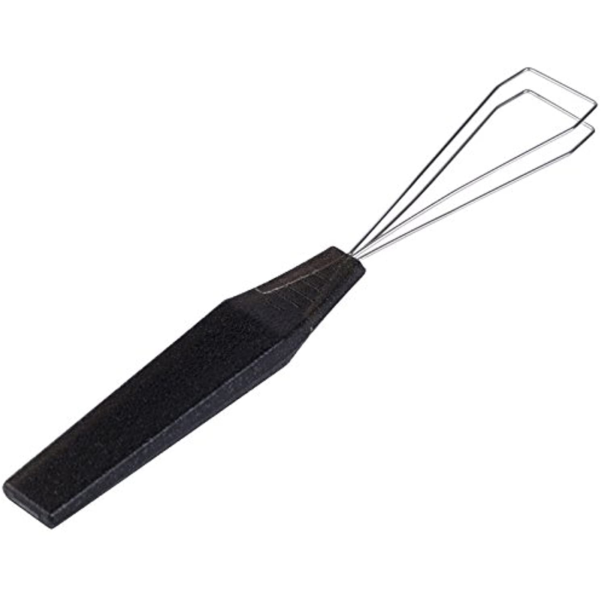

# Необходимый минимум инструментов

Owner: keebcult

### Кейкап-пуллер

Простой и дешевый рабочий вариант

Особенно хорош Gateron Keycap Puller, но стоит он около $30 - [aliexpress](https://aliexpress.ru/item/1005003918440384.html?sku_id=12000027463753039&spm=a2g2w.stores.seller_list.11.4b8b7ca267fTyf)

### Свич-пуллер

](Необходимый минимум инструментов/Untitled%202.png)

TX Switch Puller - [divinikey](https://divinikey.com/collections/keyboard-tools/products/tx-switch-puller)

Можно легко найти на али по запросу “switch puller”

Рекомендую приобрести оба. Первым удобно доставать свичи из углов и крайних рядов собранной клавиатуры.

### Набор отверток

Xiaomi Mi Precision Screwdriver Kit

iFixit Screwdriver Kit

### Если у вас клавиатура без шумок и с мягким плейтом, то очень пригодится plate support fork

Подойдет любая, можно распечатать самому.

Geon Plate Support Fork - [divinikey](https://divinikey.com/collections/keyboard-tools/products/geon-plate-support-fork)