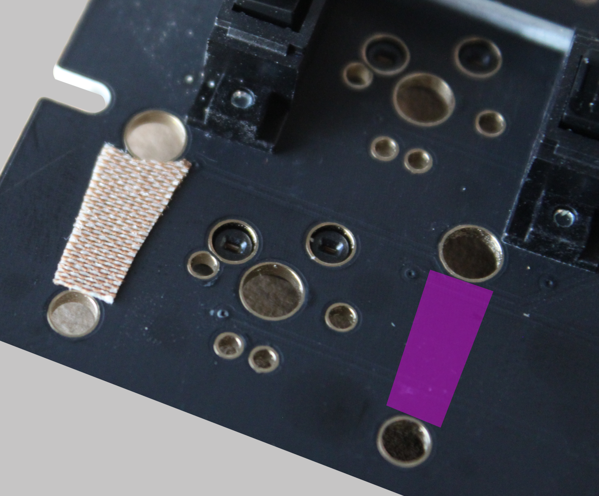
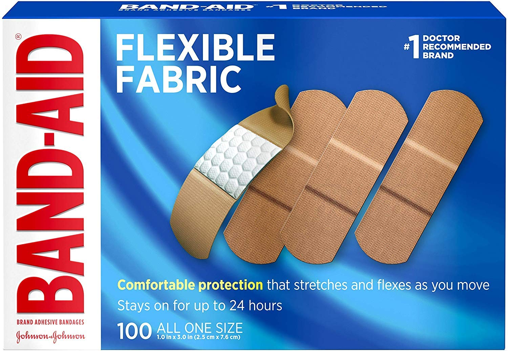
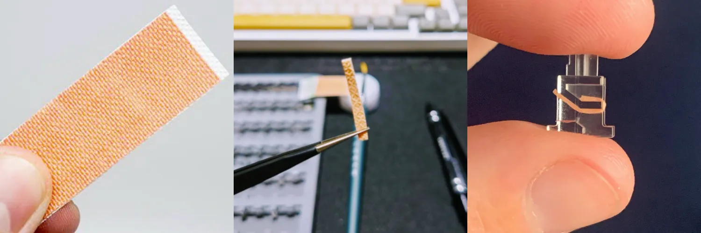
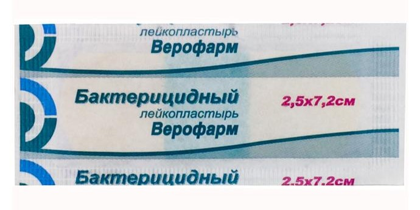

# О наклейках внутри стабилизаторов и под ними

Owner: keebcult

Коротко об этих видах моддинга стабилизаторов:

# Band-aid mod

Изначально под этим модом подразумевалась нарезка тканевых пластырей, которые впоследствии клеили под стабилизаторы. Со временем появились уже готовые прокладки под стабы, которые не нужно вырезать самому. В целом, их можно разделить на несколько категорий:

## Foam pads

Их кладут в комплект с некоторыми стабилизаторами (типа Durock v2), а еще ими торгует небезызвестные [KBDFans](%D0%9C%D0%B0%D0%B3%D0%B0%D0%B7%D0%B8%D0%BD%D1%8B%20%D0%B8%20%D0%B4%D0%BE%D1%81%D1%82%D0%B0%D0%B2%D0%BA%D0%B8/kbdfans%20com.md).

**Из минусов:** они могут впитывать в себя стекающую из стабов смазку, от чего прокладки со временем разбухают и боттом-аут (момент удара стема о пцб) у стабилизаторов становится ватным.

Некоторые люди (зачем-то) сами промазывают эти наклейки - так делать не нужно.

## Teflon pads

Их можно найти в комплекте у стабилизаторов Owlstab, а также внутри с филмами от Deskeys (там они без “ушек”, но смысл тот же).

Оптимальный вариант!

В случае использования стабилизаторов от TX - даже в тефлоновых прокладках нет необходимости.

# Holee-mod

Мод для стабилизаторов, у которых много пространства внутри стема (например, как у Durock v2).

Видео с инструкцией как его делать:

[https://www.youtube.com/watch?v=-vhpHjlkRgQ](https://www.youtube.com/watch?v=-vhpHjlkRgQ)

В качестве замены band-aid можно использовать другие пластыри с тканевой основой, например, от Верофарм:

В случае Durock v2 - я считаю этот мод обязательным.

# Epsilon mod

По своей задумке напоминает Holee-mod, только здесь вместо того, чтобы обернуть стем одним куском пластыря - используются отдельные части.

Я так пробовал делать: помимо того, что сам процесс невероятно кропотливый, со временем эти прокладки (под действием смазки) теряют свои клейкие свойства и просто вылетают из нужных мест и впоследствии мешают движению стема внутри хаузинга.
