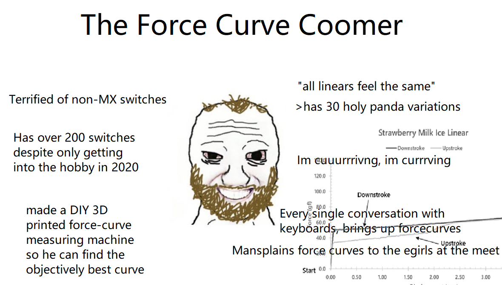
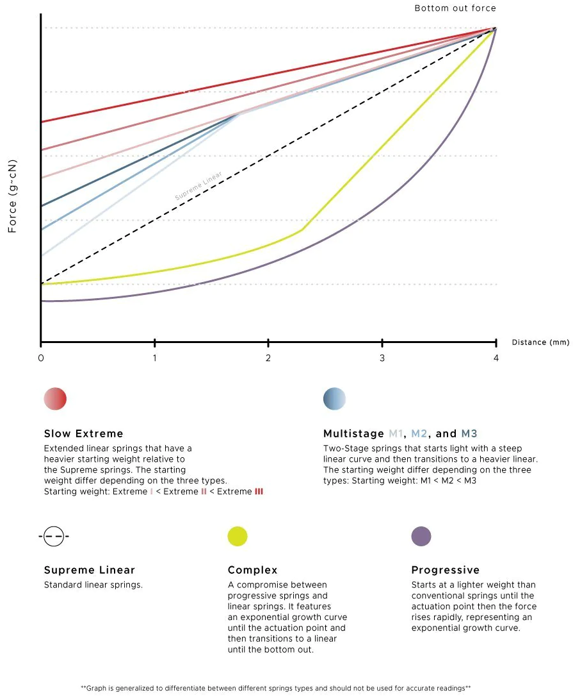
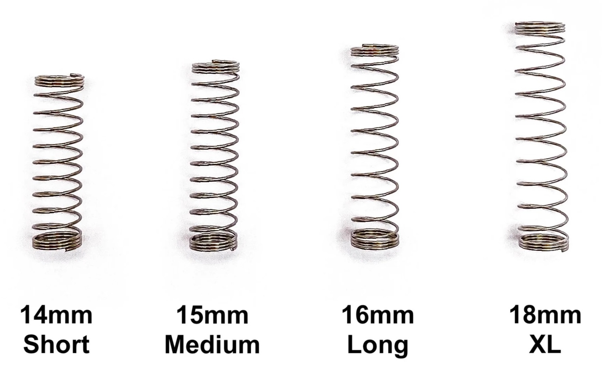
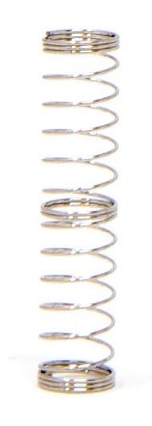
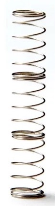
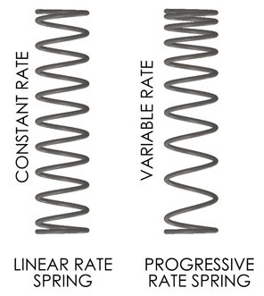

# Пружинки мои пружинки

Owner: keebcult

автор: [@sensetrigger](https://t.me/+WmaYoxoEIkg1NDky)

Пружина - крайне важная деталь свича. Она влияет не только на ощущения при печати, но и на звук. Какими они бывают и на что стоит обратить внимание? Попробуем разобраться.

# Разновидности популярных пружин в MX-свичах

- тоже самое, но чуть подробнее
    
    
    

## Linear

Самые простые и распространенные пружины, существуют со времен появления свичей Cherry MX.

### Длина линейных пружин

Чем больше длина линейной пружины - тем больше стартовое усилие.

Чаще всего в продаже можно найти три предлагаемых длины: 14мм (короткие), 15мм (средние) и 16мм (длинные).

Если вы не знаете, какая длина вам нужна - выбирайте 15мм. Это стандарт, который был заложен в свичах Cherry MX.

Тем не менее, разница между 14мм и 16мм не такая огромная, как некоторым может показаться.

<aside>
⚠️ В пружинах длиной 20-22мм часто возникают проблемы с пингом.

</aside>

### Какие линейные пружины купить

Хорошие производители линейных пружин - TX, Geon (18mm), [CannonKeys Medium (18mm)](https://cannonkeys.com/products/ck-springs?variant=41101506216047)

## Multi-stage

Мульти-стейдж пружины больше всего отличаются двумя вещами: они легкие “на старте” и быстро возвращаются при апстроуке (после того, как вы нажали на свич и отпустили его). 

Из-за этого получается необычный звук “удара по топу”, который довольно сильно отличается от звука при нажатии (боттом-аут).

Из особенностей: они часто ощущаются тяжелее заявленного веса.

### Какие мульти-стейдж пружины купить

**2-stage:** Tecsee - хорошие, но довольно дорогие ($12-$15), DUROCK Gold Plated Springs 67g 2-Stage

**3-stage:** Geon - из-за длины в 22мм у них есть немного кранча в звуке, но если для вас этот момент не является критичным - то вполне себе неплохой вариант. Они приятно ощущаются и стоят недорого - в районе $6.

## Progressive

Для прогрессив-пружин справедливо то, что написано про мультистейдж-пружины. Однако при апстроуке они “отстреливают” не так бодро.

### Длина прогрессив-пружин

Чтобы прогрессив пружина “работала” - она должна быть длинной в 16-18мм.

Как работает пружина в свиче Prevail Epsilon (67гр):

1. Начало нажатия - 54гр
2. Срабатывание - 60гр
3. Боттом-аут (последние 30% хода) - 67гр

Если длина больше 18мм - процент брака растет в геометрической прогрессии (и их труднее изготовить).

### Какие прогрессивные пружины купить

Prevail, но их уже не производят 👍 Эти пружины можно найти только в составе свичей Prevail Nebula и Prevail Epsilon. Избегайте их покупки на алиэкспрессе - есть шанс наткнуться на отбраковку (речь идет о первой версии - v1). Прогрессивные пружины от SPRIT и C3 тоже довольно спорные.

---

**За дополнения спасибо [https://t.me/ForgottenHunter](https://t.me/ForgottenHunter)*