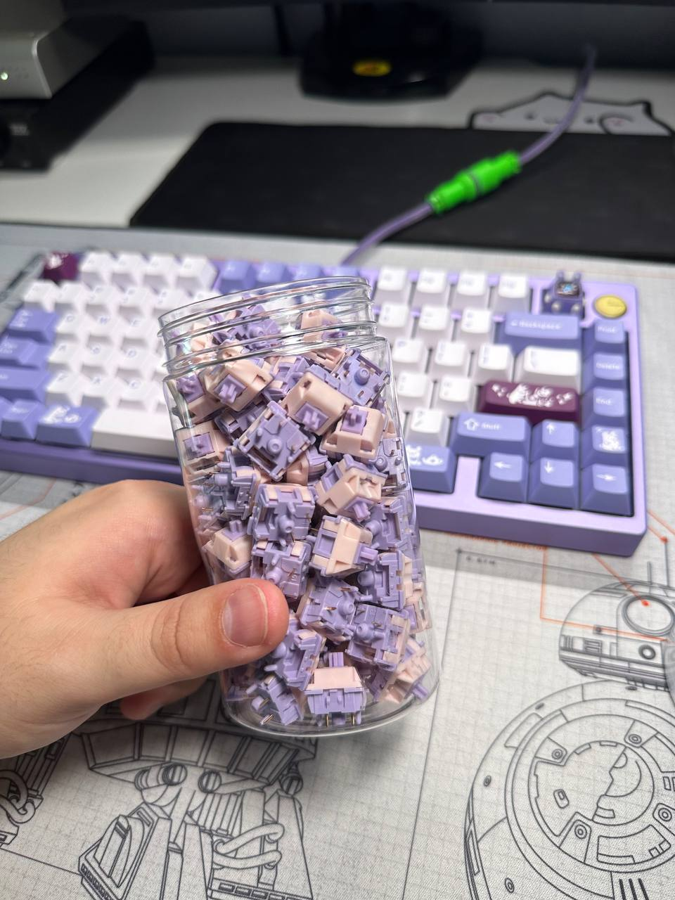

# Рекомендации и отзывы на разные свичи

Owner: keebcult

## Рекомендации линейных свичей от @ForgottenHunter

Вот список Линеек, которыми я пользуюсь на постоянной основе и каждый из этих свитчей у меня лежит в моей личной коллекции , минимум одним набором, не на продажу:

Zaku linear
Prevail epsilon
Prevail nebula
Emogogo linear
Alpaca
SP-Star Ube Crinkle
Durock POM
Gateron mizu mink
Zenclack Oooolong
Qwertypop Quartz v2
IFK Cow Pom
MX Black (b-in)

Неплохие прелюб свичи: joininkeys midnight blue

Хорошие варианты, которые я просто не люблю:
С3 Tangerine
C3 Banana Split
Giant V5
Gateron Black Ink
Gateron Oil King
Thic Thock Marshmallow

Тактилки я особо не люблю, и сам пользуюсь только 2 видами (Zaku, Geon Clear). Но вот список неплохих вариантов, которые я отметил для себя, когда использовал в каких-то заказах:
Boba U4T
Zaku II (Tactile)
Durock Anubis
DK Saru
Geon Clear
Emogogo tactile
С3 Kiwi
К моему удивлению - Glorious Panda (намного лучше дроповских аналогов Холи-Панд)
Tecsee Purple Panda

## Отзыв на MMD Princess (они же хайфай маджонг пентагон) от @ForgottenHunter

Доехали  MMD Princess   a.k.a.  Хайфай маджонг пентагон

Если рассматривать их с учетом цены - отличные свичи , но консистенси отсутствует.
нормальных свичей которыми можно пользоваться без смазки - штук 15 из всей пачки.
Пружины не пингуют ,  но ощутимо похрустывают (как там буржуи называют - Кранчи)
Плавность за такую цену - отличная.

Если рассматривать их в отрыве от цены, то они довольно таки хай питч.
Само по себе это не плохо, но есть хай питч свичи с каким-то более обьёмным и приятным звуком , те же заку / небулы / BBN
MMD же звучат хай питч , но очень плоско.

Эти принцесски очень сильно напоминают Chosfox DD/Jingle
Они такие же плавные и имеют абсолютно идентичный звук.
Но джинглы намного лучше смазаны с завода.

При этом?
90 джинглов будет 32 бакса + шип
А ММД - 16 + фри шип

Явно отличный вариант свича, когда нужно что-то очень дешевое и лонг полловое

## Отзыв на MMD Princess от @Forschmack

первый взгляд на хайфай маджонг пентагоны

единственное что в этих свитчах консистентно — это их неконсистентность

слева направо от эталонного звука без лишних примесей до "полного пентагона"
хотя даже в добротном хайфае они все звучат по разному

что могу сказать?
долбилово
звонкое
дешёвое
нестабильное

## Отзыв на Haimu Whisper от Dmitry Koshelev

- в использовании 1,5 года, дейли драйвер на работе. Не то чтобы печатаю как программист обпившийся кофе, но немало.
- не смазывались, не открывались, сток как был.
- свичи перемешивались в процессе, есть вероятность что кому-то откровенно не повезло, но это уже погрешность измерений.

Из ~70 свичей идеальными осталось только 4. Еще 5 хочется нахуй выкинуть, но я попробую их разобрать и привести в чувства (не только пингуют, но и есть паразитные звуки). Остальные с пингом различной степени громкости, где-то еле слышно, где-то звенит как сволочь.

По результатам могу сказать что это отличный сайлент свич с сильной тактильной отдачей.
В офисном пространстве громкость на уровне ноутбучной или внешней маковской клавиатуры, тоесть полностью пригодны для "тихой" печати.

## Обзор Hyacinth от negativich

[О разновидностях свичей Hyacinth](%D0%9E%20%D1%80%D0%B0%D0%B7%D0%BD%D0%BE%D0%B2%D0%B8%D0%B4%D0%BD%D0%BE%D1%81%D1%82%D1%8F%D1%85%20%D1%81%D0%B2%D0%B8%D1%87%D0%B5%D0%B9%20Hyacinth%201dd967f667254b6b88cd8ab242673d37.md)

## Отзыв на Huano Aires от @ksotnikov

Небольшой отзыв на свитчики Huano Aries со стемом из какой-то новой херни, которая называется HNp7 и корпусом из POK.
Сначала я думал что купил очередную херню. Спойлер - это нет так.

Сначала минусы:

1. Блядские LED диффузоры. Вот везде они как бы есть и есть, а тут, лучше бы их не делали.
После открытия свитча диффузор остается в топке свитча. При закрытии свитча он вставляется только под прямым углом. Сидит очень плотно, малейшее отклонение от перпендикуляра и он встает раком, свитч не закрывается. Учитывая, что смазку внутри надо следует размазать по стему, то это очень сильно замедляет процесс.
2. Стемы надо тримить. Вот прям НАДО. Новый GMK сет даже не думайте надевать без подготовки свитча, покрекаются все нафиг. Самое не очень это то, что тримится стем очень сложно. Стем мягкий, но упругий. За счет этого приходится давать "угла" триммеру, иначе он просто очень туго садится на стем и не тримит его, просто застревая.
3. Свитчам просятся филмы. В передней части все отлично, потому что там есть диффузор, который дает хорошую сцепку топа с боттомом. Задняя чуть погуливает. Не могу сказать что здесь это критично очень, но лучше добавить.

Плюсы:

1. Очень хорошая смазка (не результат смазки с завода). В целом ее в свитче достаточно, но её надо нормально равномерно размазывать по передней и задней стенке, потому что туда ее не попало. Увы. PR05 название этой смазки, это микс из PFPE + PTFE. Ощущается очень плавненько и прикольно, размазывать легко.
2. Воблы почти нет, очень плотная подгонка, ощущается как HMX. Рейлы с выемкой, наверное это плюс, т.к. меньше трения.
3. Абсолютное отсутствие лифпинга и пингспринга. Ощущается как-будто это микс МХ свитча с HE свитчем, в целом едва уловимо чувствуется работа лифов. Очень приятные впечатления, редко такие свитчики встречаются. Пружины 20мм, сухие в стоке, но ровные.
4. Звук и тайпфил. Звучит свитчик довольно низко, на 1.2 с фомом, тот еще крими попи. Учитывая материал хаузинга - POKi-Chpoki отлично подойдет как описание, если требуется такое). Чем-то напоминает свитч Гатерон Смузи, только на максималках и со звуком пониже и погромче.
Стем плоский, мне такой стем заходит только на мягких материалах стема, как здесь.
5. Цвет - бежевый уретро, мэтчится с любым сетом из ближайшей помойки.

Поставил их в себас на 1.2 плату, уже неделю довольно приятно булькаю свитчами. Если не страшны вам минусы - рекомендую попробовать. Стоят недорого.