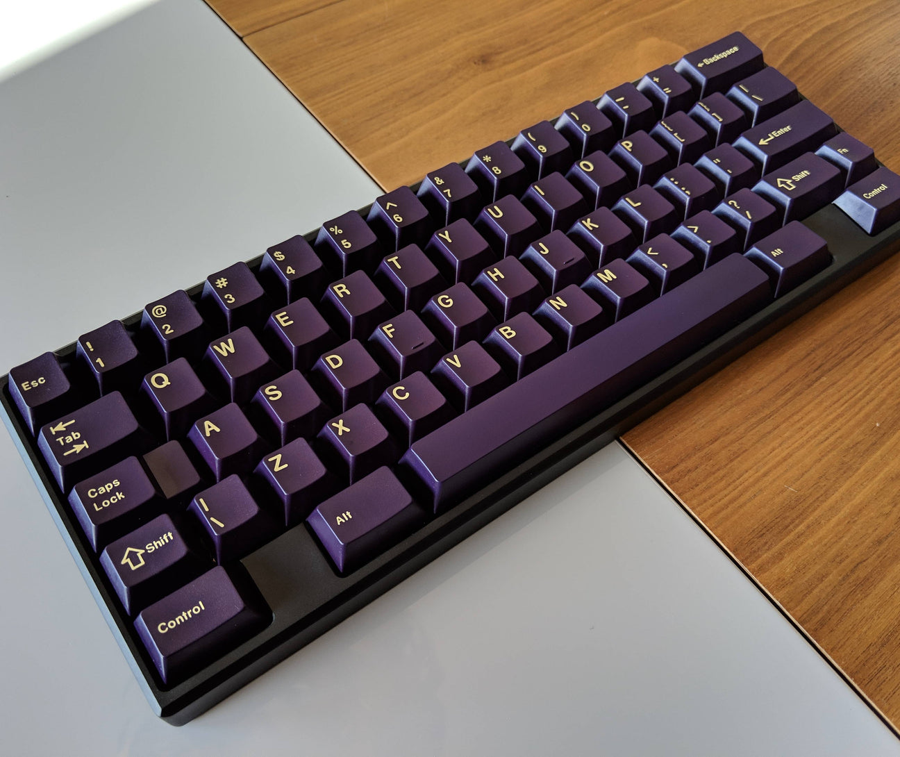

# Словарь терминов и сленга

Owner: keebcult

[**спросить о значении термина**](https://forms.gle/g7tgJ7bDHn9FAnHN6)

**Альфы** — кнопки со знаковым обозначением (буквы).

**Анек** — новичок с претензией на “экспертность” или задающий вопросы, которые обсуждались в чате множество раз (и ответ на которые легко находится с помощью гугла или поиска по чату). Пошло со времен мехкульта и дословно означает “человек-анекдот”.

**Бампоны** — резиновые ножки на дне клавиатуры

**База** — base kit у набора кейкапов. Клавиатура без свичей и кейкапов - все ещё клавиатура.

- **Безели** — ширина “рамки” у топа клавиатуры
    
    Слово пошло от [детали на наручных часах](https://ru.wikipedia.org/wiki/%D0%91%D0%B5%D0%B7%D0%B5%D0%BB%D1%8C).
    
    Клавиатура с узкими безелями:
    
    
    
    Клавиатура с широкими безелями:
    
    
    

**Блокеры** — часть корпуса клавиатуры, которая блокирует доступ к определенным клавишам

**Бубокс** — клавиатура BBOX60 от BurgerWork

**Киттинг** — состав кейкапов, входящих в тот или иной комплект

**Лира** — клавиатура Lyre (40% с нампадом)

**Лонгпол** — свич с [удлиненной](%D0%A7%D0%B5%D0%BC%20%D0%BE%D1%82%D0%BB%D0%B8%D1%87%D0%B0%D0%B5%D1%82%D1%81%D1%8F%20%D0%BE%D0%B1%D1%8B%D1%87%D0%BD%D1%8B%D0%B9%20%D1%81%D0%B2%D0%B8%D1%87%20%D0%BE%D1%82%20long-pole%20e598887e0f7f41219999e3385785b7b6.md) пипкой у стема

**Маунт** — тип крепления печатной платы (PCB) или плейта (Plate) к корпусу.

**Моды** — кнопки модификаторов (Ctrl, Alt, Enter, Tab и т.д.)

- **Пинг** — специфичный металлический призвук внутри корпуса клавиатуры или свича
    
    Важно не путать пинг с обычной реверберацией (”эхом”) внутри корпуса.
    
    Пример пинга в клавиатуре:
    
    [https://www.youtube.com/watch?v=ZaCm9sQnX4M&t=34s](https://www.youtube.com/watch?v=ZaCm9sQnX4M&t=34s)
    
    [https://www.youtube.com/shorts/f5l6sGEVaU8](https://www.youtube.com/shorts/f5l6sGEVaU8)
    
    Пример пинга в свичах:
    
    [https://www.youtube.com/watch?v=TBR3miWgB3c](https://www.youtube.com/watch?v=TBR3miWgB3c)
    

[Рыгачька, блювачька, отрыжка и прочие термины из мехкультовского палеозоя](Словарь терминов и сленга/%D0%A0%D1%8B%D0%B3%D0%B0%D1%87%D1%8C%D0%BA%D0%B0,%20%D0%B1%D0%BB%D1%8E%D0%B2%D0%B0%D1%87%D1%8C%D0%BA%D0%B0,%20%D0%BE%D1%82%D1%80%D1%8B%D0%B6%D0%BA%D0%B0%20%D0%B8%20%D0%BF%D1%80%D0%BE%D1%87%D0%B8%D0%B5%20%D1%82%D0%B5%D1%80%D0%BC%D0%B8%D0%BD%D1%8B%20%D0%B8%D0%B7%20%D0%BC%20c01d9175c22942309575314c4264f4b2.md)

**Actuation Force** — усилие нажатия на кнопку до ее срабатывания.

**Actuation Point** — место, в котором находится стем во время срабатывания нажатия.

**ALPS** — ретро свитчи для механических клавиатур. Сейчас используются только энтузиастами и коллекционерами. Крайне тяжело найти в хорошем состоянии.

**ANSI** — American National Standards Institute Layout, Американский стандарт для раскладки клавиатуры. От ISO отличается однорядным Enter, длинным левым Shift.

**Bar (бар)** — выпуклая "палочка"

[**Catch-ball** (кэтч болл)  ](Словарь терминов и сленга/Catch-ball%20(%D0%BA%D1%8D%D1%82%D1%87%20%D0%B1%D0%BE%D0%BB%D0%BB)%20459c11086a76479f924f3b9663ce22b1.md)

**Dot (дот)** — выпуклая точка

**FCFS** — first come first serve, вид очереди “первым пришел — первым обслужен”. Иначе говоря, “кто первее успел, тот и победил”. В случае популярных релизов выигрывают либо те, кто написал бота, либо те, у кого лучше интернет-соединение.

**FR4** — текстолит, материал, из которого делают печатные платы и плейты

**FRL** — F-row-less, клавиатура без ряда F-клавиш, если он там подразумевается типоразмером. (например, FRL-TKL)

**Groupbuy** (групбай) ****— групповая закупка. Покупатели вносят (зачастую полную) предоплату, дизайнер заказывает партию, вендор эту партию получает и рассылает покупателям их товар. Такой формат дает возможность дизайнерам заказать партию, не вкладывая собственных денег (грубо говоря, партия из 100 клавиатур за $300, к примеру, может стоить $30000: мало кто может себе позволить выложить такую сумму, еще и не имея гарантии того, что всю партию точно купят).

**Homing** (хоуминг, хоминг) — модификации для клавиш F и J, на которых находятся указательные пальцы. Бывают разных видов:

[**Home row** (дословно "ряд домашних клавиш", где находятся буквы F и J)](Словарь терминов и сленга/Home%20row%20(%D0%B4%D0%BE%D1%81%D0%BB%D0%BE%D0%B2%D0%BD%D0%BE%20%D1%80%D1%8F%D0%B4%20%D0%B4%D0%BE%D0%BC%D0%B0%D1%88%D0%BD%D0%B8%D1%85%20%D0%BA%D0%BB%D0%B0%D0%B2%D0%B8%D1%88%20,%20%D0%B3%D0%B4%D0%B5%20%D0%BD%D0%B0%D1%85%D0%BE%D0%B4%20843644179a6b4ed3acda94e710939fba.md)

**Interest Check** (он же IC) ****— проверка интереса к товару. Позволяет хотя бы примерно рассчитать [MOQ](%D0%A1%D0%BB%D0%BE%D0%B2%D0%B0%D1%80%D1%8C%20%D1%82%D0%B5%D1%80%D0%BC%D0%B8%D0%BD%D0%BE%D0%B2%20%D0%B8%20%D1%81%D0%BB%D0%B5%D0%BD%D0%B3%D0%B0%2034f02f27d9d24afd8f37e277a7365e46.md), что напрямую повлияет на цену [групбая](%D0%A1%D0%BB%D0%BE%D0%B2%D0%B0%D1%80%D1%8C%20%D1%82%D0%B5%D1%80%D0%BC%D0%B8%D0%BD%D0%BE%D0%B2%20%D0%B8%20%D1%81%D0%BB%D0%B5%D0%BD%D0%B3%D0%B0%2034f02f27d9d24afd8f37e277a7365e46.md).

**MOQ** — minimum order quantity, или же “минимальное количество экземпляров для заказа”. Если у клавиатуры указан MOQ в 10 единиц, это означает, что если купят только 9 штук — [групбай](%D0%A1%D0%BB%D0%BE%D0%B2%D0%B0%D1%80%D1%8C%20%D1%82%D0%B5%D1%80%D0%BC%D0%B8%D0%BD%D0%BE%D0%B2%20%D0%B8%20%D1%81%D0%BB%D0%B5%D0%BD%D0%B3%D0%B0%2034f02f27d9d24afd8f37e277a7365e46.md) не состоится.

**ISO** — европейский стандарт, обычно клавиатуры с такой раскладкой продаются в странах СНГ. Двухрядный Enter, левый Shift разбит на две кнопки, перед энтером появляется еще одна дополнительная кнопка в Home Row.

**HHKB** — тип раскладки, в котором вместо клавиш "Ctrl" используются блокеры. Caps Lock заменяется на Control, правый Shift разбит на две кнопки.

**In-stock** (instock, инсток) — товар, который уже произведен и есть в наличии.

**Ortho** (ортолинейная) — клавиатура, в которой ряды не смещены относительно друг друга, ни вертикально, ни горизонтально. Одна кнопка находится строго под другой, чаще всего используются только 1ю кнопки.

**PCB** — Printed Circuit Board, плата с припаянными на ней компонентами

**QMK** (Quantum Mechanical Keyboard) — открытая прошивка для механических клавиатур. На ее основе строятся VIA и VIAL. Огромный функционал, но нет возможность менять раскладку "на лету". Для внесения изменений необходимо пересобирать прошивку и загружать на клавиатуру.

**Raffle** (рафл, раффл) — лотерея на право покупки. Обычно раффл проводят на популярные релизы (когда клавиатур, к примерно, произвели 100 штук, а желающих - 10000 человек). Поскольку такой спрос удовлетворить крайне непросто, дизайнеры поступают двумя способами: либо выставляют товар по схеме [FCFS](%D0%A1%D0%BB%D0%BE%D0%B2%D0%B0%D1%80%D1%8C%20%D1%82%D0%B5%D1%80%D0%BC%D0%B8%D0%BD%D0%BE%D0%B2%20%D0%B8%20%D1%81%D0%BB%D0%B5%D0%BD%D0%B3%D0%B0%2034f02f27d9d24afd8f37e277a7365e46.md), либо разыгрывают право покупки среди желающих. Раффл бывает как на [инсток](%D0%A1%D0%BB%D0%BE%D0%B2%D0%B0%D1%80%D1%8C%20%D1%82%D0%B5%D1%80%D0%BC%D0%B8%D0%BD%D0%BE%D0%B2%20%D0%B8%20%D1%81%D0%BB%D0%B5%D0%BD%D0%B3%D0%B0%2034f02f27d9d24afd8f37e277a7365e46.md)-товары, так и на [групбайные](%D0%A1%D0%BB%D0%BE%D0%B2%D0%B0%D1%80%D1%8C%20%D1%82%D0%B5%D1%80%D0%BC%D0%B8%D0%BD%D0%BE%D0%B2%20%D0%B8%20%D1%81%D0%BB%D0%B5%D0%BD%D0%B3%D0%B0%2034f02f27d9d24afd8f37e277a7365e46.md).

**Scoop** (скуп) — кнопки F и J имеют углубление относительно кейкапов в этом ряду.

**Stab Shims** (шимсы, шимы) — шайбы для стабилизаторов, которые нужны только в случае установки стабилизаторов с поддержкой 1.6мм PCB на 1.2мм PCB

**Tsangan** (цанган) — популярная раскладка среди энтузиастов. Нижний ряд симметричен, используется 7u пробел (стандартная длина пробела для ANSI/ISO = 6.25u) кнопка Backspace и RShift разбиваются на две.

**Tsangan row** — когда речь идет только о нижнем ряде, то есть: 1.5u-1u-1.5u-7u-1.5u-1u-1.5u

**Unit** (1u, 1ю) — размер одного юнита равен размеру одного буквенного кейкапа (альфы). Все кнопки на клавиатуре кратны 0.25u (буквы = 1u, Enter = 2.25u, ANSI Space = 6.25u)

**VIA** — разновидность прошивки для механических клавиатур, которая строится на QMK. Предоставляет удобный графический интерфейс пользователя, который позволяет легко настраивать раскладку клавиш, определять макросы, устанавливать функциональные команды и многое другое без необходимости программирования вручную. Функционал сильно ограничен относительно QMK (хоть VIA и строится на его основе). Относительно популярное решение для тех, у кого нет необходимости в расширенных командах.

**VIAL** (Versatile Input and Adaptation Layer) — это прошивка, разработанная для клавиатур, совместимых с QMK. Она предоставляет расширенные функции настройки и адаптации, что делает ее более удобной для конечных пользователей. Позволяет использовать Combo, Tap-Dance, Mod-tap и настраивать клавиатуру прямо из окна браузера или десктопного приложения.

**WKL** — тип раскладки, в котором вместо клавиш "Win" используются блокеры.

**XT** — дополнительный функциональный блок клавиш сбоку от основной раскладки

**ZMK** (Zambumon Keyboard) — это фреймворк для разработки прошивок для беспроводных механических клавиатур. Он предоставляет инфраструктуру для создания прошивок, которые поддерживают различные беспроводные технологии, такие как Bluetooth. ZMK используется для создания прошивок для беспроводных клавиатур. В основном это эргономичные клавиатуры или разные самоделки.

---

большая благодарность [@kapee1](http://t.me/kapee1) за дополнение заметки!