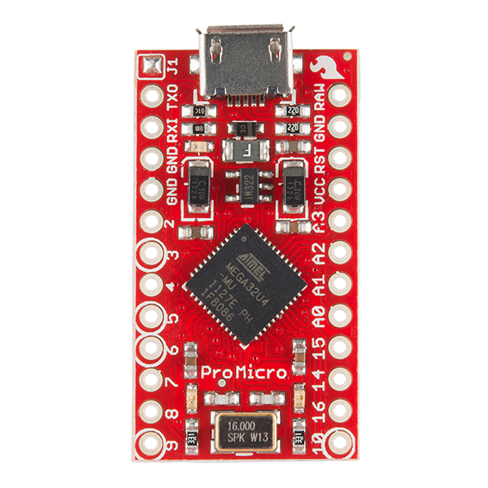

# Atmega32U4

Owner: keebcult

В настоящее время микроконтроллер Atmel Atmega32U4 является основной рабочей лошадкой в проектах самодельных и мелкосерийных клавиатур. Он хорошо задокументирован и хорошо изучен за несколько лет производства, имеет USB-стек и стоит недорого.

В небольших проектах удобно использовать готовые платы: упрощается проектирование печатной платы (не нужно размещать, а затем паять миниатюрные SMD-компоненты), возможен навесной монтаж, прошит загрузчик.

# Pro Micro

## Sparkfun Pro Micro

Оригинал производства Sparkfun. Особого смысла покупать его нет, стоит $16. Стоит заметить, что Sparkfun распространяет дизайн Pro Micro под свободной лицензией, так что упрекнуть китайцев в пиратстве тут нельзя. Доступно 18 пинов ввода-вывода. Ещё два (B0 и D5 в качестве выходов) можно получить, припаявшись к набортным светодиодам.

## Синий Pro Micro

Один из распространённых китайских клонов на плате синего цвета. Стоят они на Aliexpress начиная от $3 с небольшим. Встречаются разновидности на 5 В / 16 МГц и 3,3 В / 8 МГц (последний может понадобиться для конвертера usb_usb).

## Чёрный Pro Micro

Совпадают по форм-фактору с синими, но используется Atmega32U4 в более крупном корпусе 44TQFP вместо 44QFN, что позволяет [подключиться к ещё 5 пинам](https://www.40percent.club/2018/05/black-pro-micro-25-pins.html) (итого: 18+2+5=25): B7, C7, D6, F0, F1.

## «Толстый» чёрный Pro Micro

Можно узнать по жёлтым конденсаторам и логотипу Diymore на обратной стороне платы. Разъём micro-USB значительно прочнее — монтируется через отверстия в плате. Имеет ту же распиновку, что и обычные Pro Micro, но плата на 2,54 мм шире. Предпочтительный вариант для навесного монтажа, но вставить в плату, рассчитанную на обычный Pro Micro не получится.

## Квадратный Pro Micro

Можно найти на Aliexpress под названием «Strong Pro Micro». Несколько разновидностей: 3,3/5 В и micro/mini-USB. Несколько дороже других китайских плат, но расположение пинов и наличие крепёжных отверстий может быть удобным для навесного монтажа. Доступно 20 пинов. Присутствует кнопка reset и крепление USB-разъёма через отверстия в плате.

# RobotDyn Micro

Просто Micro, без Pro. Плата длиннее и дороже, чем дешёвые Pro Micro, но доступно сразу 24 пина, и кнопка reset лишней не будет.