# Фантастическое анодирование и где оно обитает

Owner: keebcult

автор: [@sensetrigger](https://t.me/+WmaYoxoEIkg1NDky)

Если вы увидели какую-то грубую ошибку - напишите мне об этом в [telegram](http://t.me/sensetrigger) и я ее исправлю. Приятного чтения!

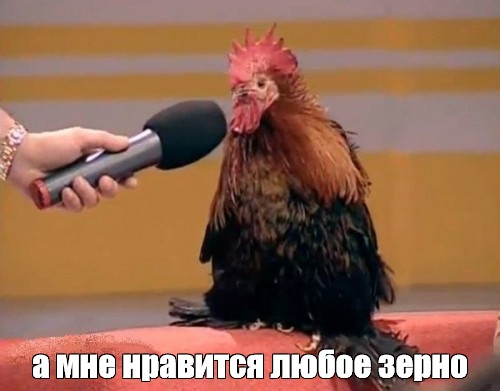

- Дисклеймер
    
    Я не являюсь экспертом в области cnc и/или анодирования, и эта статья состоит из трех вещей:
    
    1. Реферата на тему анодирования по популярным источникам
    2. Компиляции того, что я узнал об анодировании клавиатур за годы нахождения в хобби
    3. Личных впечатлений, исходя из взаимодействия с разными алюминиевыми клавиатурами

# Что такое анодирование

Анодирование — это процесс создания оксидной плёнки на поверхности металла путём анодной поляризации в проводящей среде.

# Как происходит процесс обработки детали

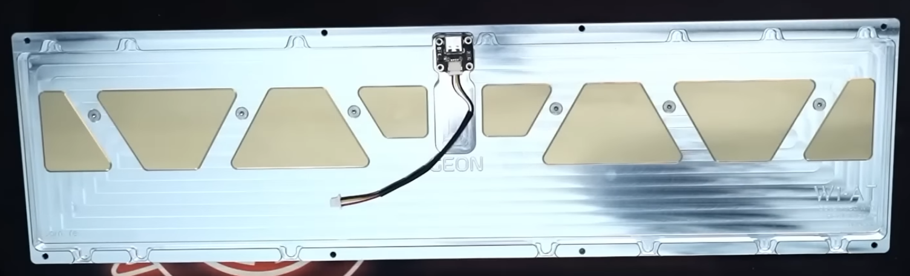

до

после

## 1. Пескоструй (bead blasting)

Сначала нужно избавить деталь от следов обработки (machining marks). Для этого ее пескоструят:

Обычно этим процессом занимаются те же люди, которые будут впоследствии выполнять анодирование (поскольку им лучше знать как должна выглядеть поверхность материала).

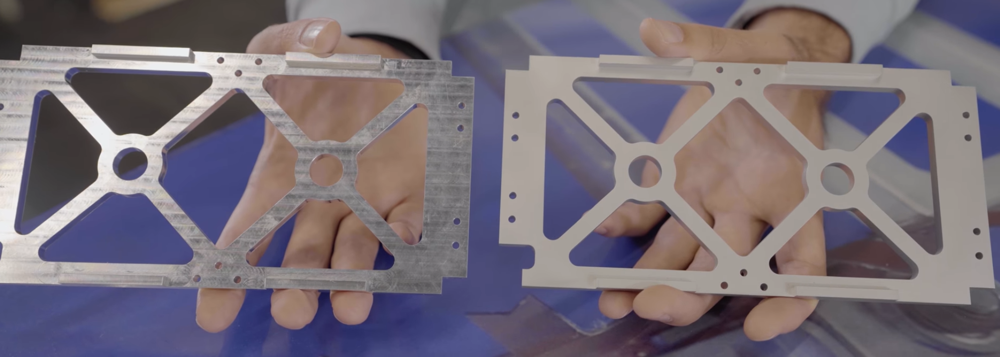

до пескоструя и после

## 2. Закрепление (racking)

Установка деталей на стойку, которая будет не только их держать, но и помогать проходить электричеству.

## 3. Химическая очистка (cleaning)

sodium hydroxide

Этот этап играет важную роль в определении качества анодирования, поскольку любые остатки влаги или ионов, могут привести к появлению крошечных белых пятен на поверхности алюминиевой заготовки.

Помимо пятен, частицы пыли и грязи на поверхности могут привести к неравномерному травлению в процессе анодирования:

## 4. Травление (etching)

После очистки, заготовки подвергаются травлению в отдельной ванне, состоящей из каустического или кислотного травильного раствора, который удаляет тонкий слой алюминия, создавая однородную поверхность.

Слой анодизации добавляет детали толщину (примерно 2/3 внутрь и 1/3 снаружу), но травление нивелирует эту разницу.

## 5. Осветление или нейтрализация (desmutting)

После травления на деталях появляется налет (smut).

Все, что в сплаве не является алюминием (цинк, кремний и т.д.), плохо реагирует с sodium hydroxide. На этом этапе все эти элементы удаляются с помощью кислоты, чтобы они не навредили анодированию. Анодирование лучше всего работает с алюминием, и если на поверхности будет много частиц цинка или кремния, то вы увидите мелкие пятна. 

## 6. Анодирование (anodizing)

sulfuric acid solution

При анодировании алюминиевых сплавов деталь погружают в ванную с электролитом (как правило, это раствор на основе серной кислоты и дистилированной воды) и соединяют с положительным полюсом источника тока.

Через резервуар пропускается электрический ток силой от 30 до 300 А/м2, в результате чего вещество пройдет через алюминиевый сплав и создаст на поверхности анодный оксидный слой.

Величина тока зависит от концентрации электролита и общей площади алюминиевой структуры.

Этот процесс требует точности, поскольку он не является уникальным для любых деталей - для разных размеров и разных сплавов требуется разный подход.

Оператор достает деталь из ванной через определенное время и проверяет прогресс формирования анодного слоя:

Когда достигнута нужная толщина анодного слоя (например, 10-15 микрон), оператор достает детали из ванной и переходит к следующему этапу.

## 7. Ополаскивание (rinsing)

Заготовка промывается в деионизированной воде для удаления с ее поверхности остатков ионов, что гарантирует отсутствие пятен.

Если этот этап не выполнить корректно, то на поверхности появится вязкая пленка. Впоследствии она может повредить анодному слою и его консистентности (bleeding/leaching):

## 8. Адсорбционное окрашивание (coloring)

На этом этапе анодный слой практически готов и его поверхность состоит из открытых пор, которые и заполняются красителем.

Это повышает эстетическую ценность заготовки и одновременно обеспечивает дополнительную защиту от неблагоприятных условий окружающей среды.

## 9. Уплотнение (sealing)

После завершения всех этапов анодирования необходимо закрыть поры и герметизировать оставшиеся полости на поверхности материала.

Сделать это можно двумя способами:

1. В горячей воде - просто поместить детали в кипящую воду на несколько минут
2. В холодной воде (раствор ацетата никеля)

## 10. Контроль качества (сuring/wrapping)

Контроль качества полученных деталей. 

1. Отсутствие дефектов возле точек для подвешивания деталей на крюки (hanging marks)
2. Отсутствие неравномерностей или выцветания краски

## Источники

[Understanding_and_Managing_White_Spots_on_Anodized_Aluminum.pdf](Фантастическое анодирование и где оно обитает/Understanding_and_Managing_White_Spots_on_Anodized_Aluminum.pdf)

[https://www.youtube.com/watch?v=BhUjEacii3k](https://www.youtube.com/watch?v=BhUjEacii3k)

[https://www.stankoff.ru/blog/post/767](https://www.stankoff.ru/blog/post/767)

[https://iplana.ru/anodirovanie-tech/](https://iplana.ru/anodirovanie-tech/)

[https://metallcleaner.com/aluminiy-anodirovanie.html](https://metallcleaner.com/aluminiy-anodirovanie.html)

# Как оценить качество анодирования

Вернемся к клавиатурам. На мой взгляд, критерии оценки можно разделить на две категории: объективные и субъективные.

## Объективные критерии

- равномерность покрытия
    - streaking (полосы)
    - banding - когда на границах поверхности слой темнее, а середина - светлее (либо наоборот)
- bleeding - следы, которые идут от точек подвешивания (hanging marks). Обычно детали стараются подвешивать так, чтобы эти дефекты если и были - то изнутри, а не снаружи
- color matching - сходство по тону обеих половинок клавиатур. Этого сложно добиться (из-за чего одна из половинок часто темнее/светлее другой - так называемый “ano mismatch”), поэтому некоторые производители (типа Geonworks) изначально делают цвета топа и боттома разными
- reflectivity matching - когда под одним углом цвета сходятся, а под другим - нет. Добиться такого сходства очень тяжело и мало кто этим занимается, но если вы в своем познании настолько преисполнились - дерзайте.

## Субъективные критерии

- зернистость
    - Сравнение анодирования клавиатур TGR x SINGAKBD Unikorn, Geonworks Frogpad и корпуса зарядного устройства Apple Magsafe
        
        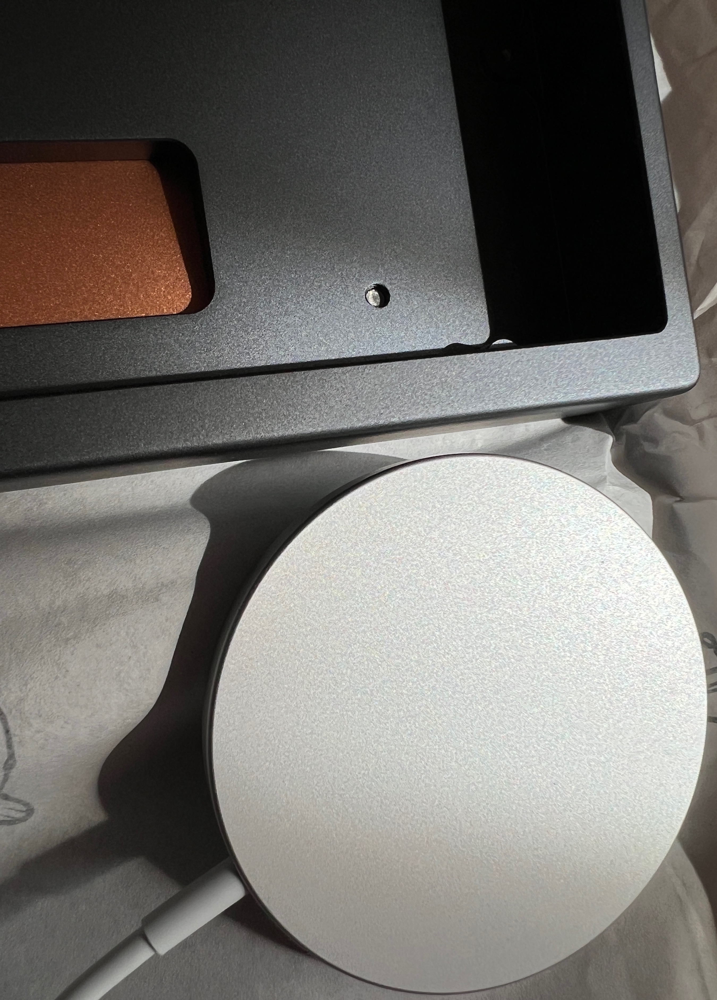
        
        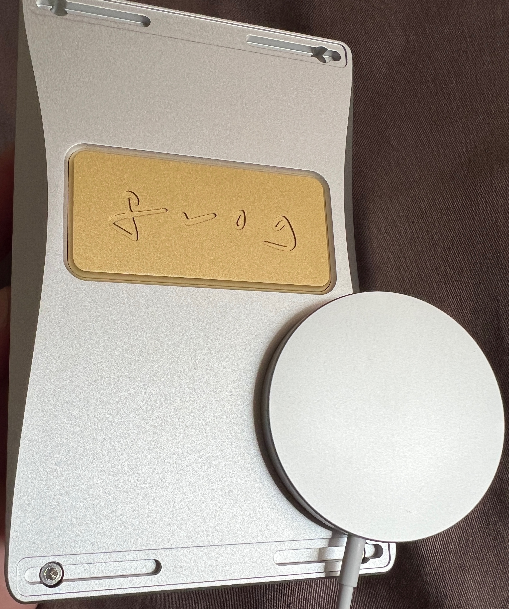
        
        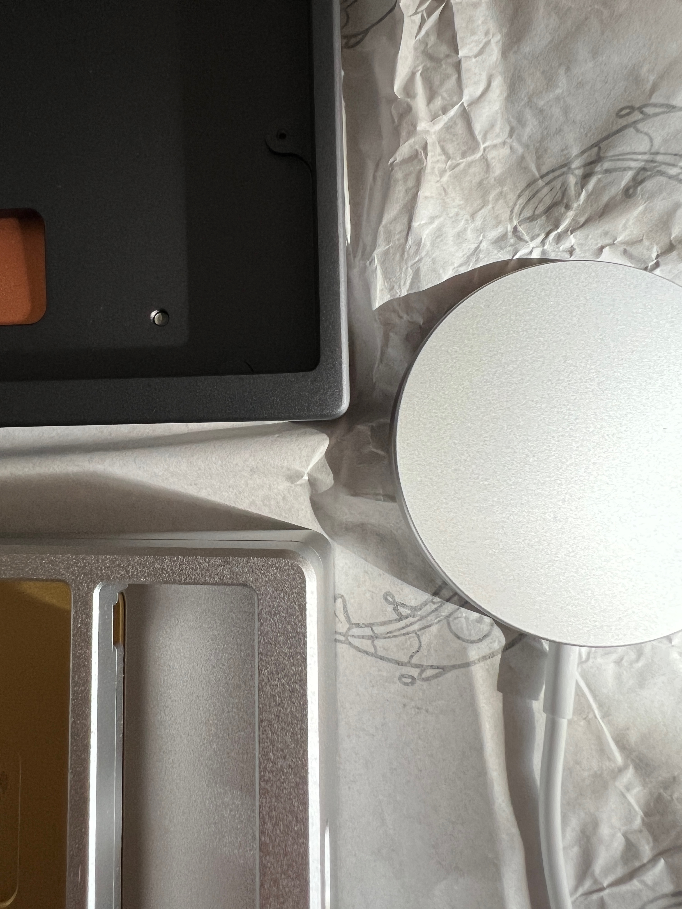
        
    - Сравнение анодирования клавиатур с заводов Bestcreating (сверху, розовый) и Dadesin (снизу, зеленый)
        
        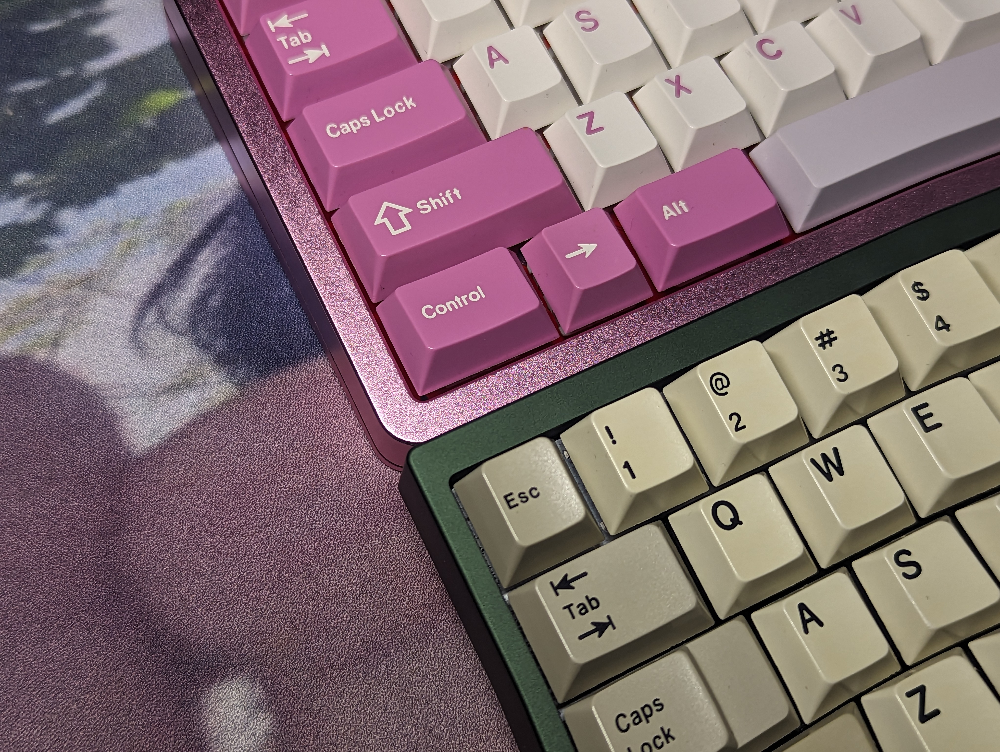
        
        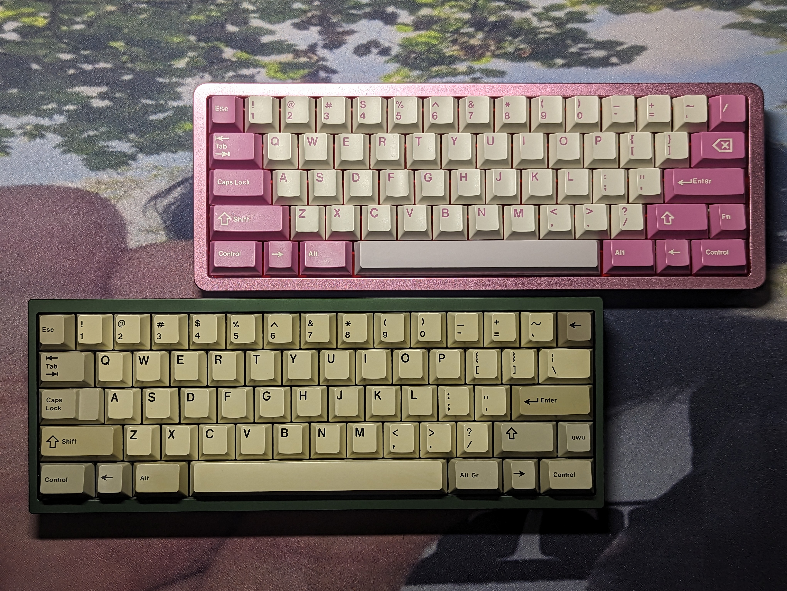
        
    
    Стоит отметить, что чем светлее оттенок - тем сильнее будет заметно “зерно”.
    
- глянцевость/шероховатость поверхности
    
    По моему опыту, даже если анодирование двух клавиатур выглядит хорошо, тактильно они могут довольно сильно различаться. У одной поверхность может быть немного фактурной и бархатистой (особенно это относится к серебряным клавиатурам, при анодировании которых не используют краситель), а у другой - слишком гладкой.
    

## Примеры плохого анодирования

- Streaking в клавиатуре Kbdfans Tofu
    
    источник: [https://www.reddit.com/r/MechanicalKeyboards/comments/wyiedq/kbdfans_refuses_to_replace_or_refund_defective/](https://www.reddit.com/r/MechanicalKeyboards/comments/wyiedq/kbdfans_refuses_to_replace_or_refund_defective/)
    
    
    
    
    
    
    
- Banding в клавиатуре OTD 356CL Dark Grey Edition
    
    источник: [https://www.instagram.com/p/CzGUQAXvEkS/](https://www.instagram.com/p/CzGUQAXvEkS/?img_index=2)
    
    спасибо за наводку [https://t.me/sixset4life](https://t.me/sixset4life)
    
    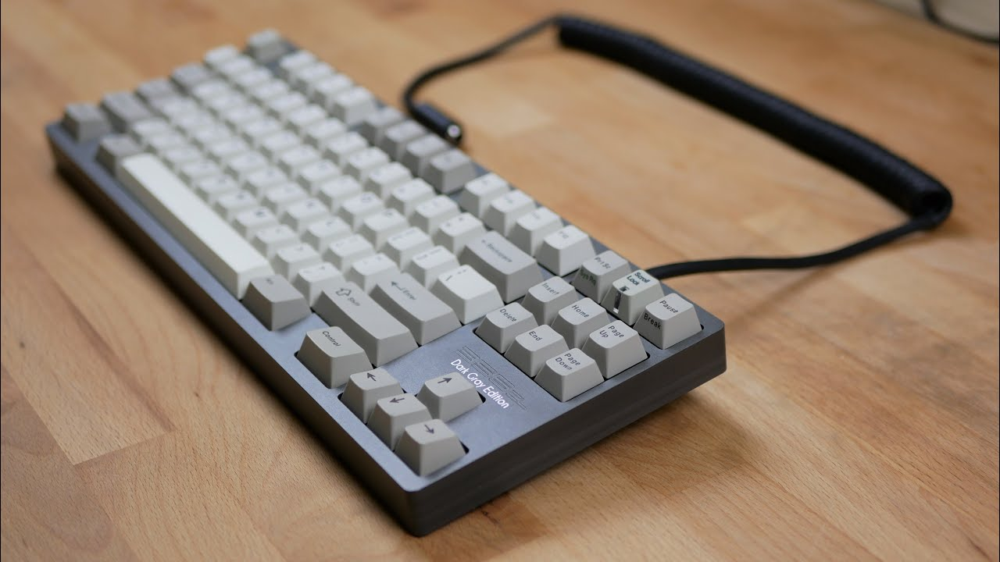
    
    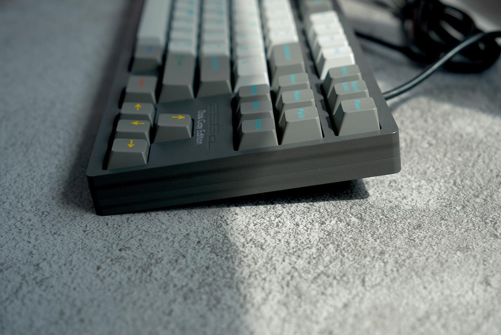
    
- Banding в клавиатуре Geonworks F1-69
    
    спасибо за фото [https://t.me/qarmaa](https://t.me/qarmaa)
    
    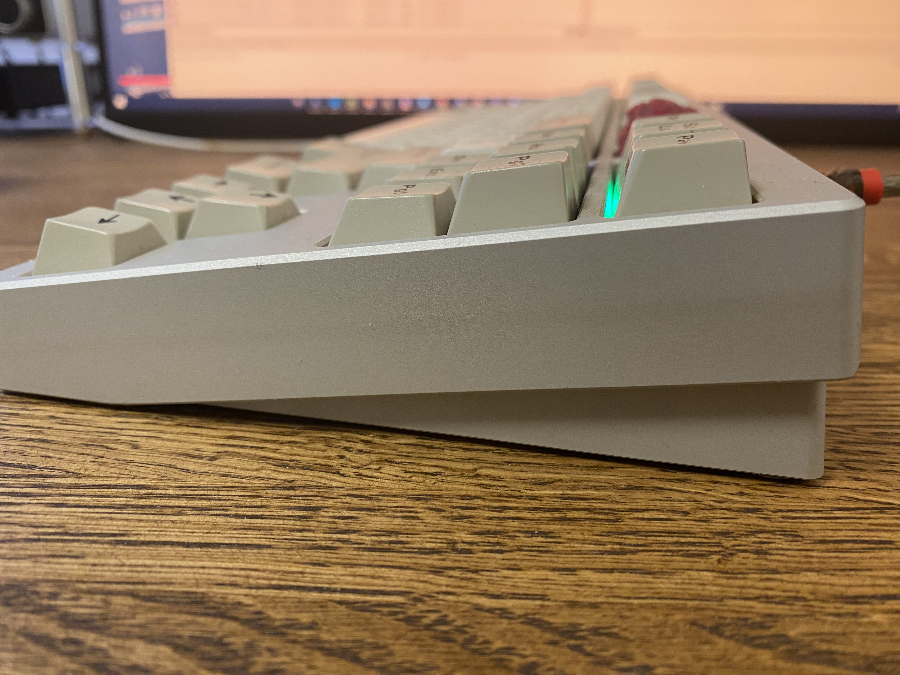
    
    горизонтальный след по центру верхней части клавиатуры
    
- Следы машинной обработки в клавиатуре Pizza80 / Fox Orange 80
    
    источник: [https://www.youtube.com/watch?v=_geFKfxDrFA](https://www.youtube.com/watch?v=_geFKfxDrFA)
    
    
    
- Ano splashing на клавиатуре Bachoo Crin
    
    источник: [https://www.youtube.com/watch?v=_geFKfxDrFA](https://www.youtube.com/watch?v=_geFKfxDrFA)
    
    
    
    может показаться что это блик/отражение, но здесь именно пятно
    
- Banding/streaking на клавиатуре Geonworks F1-8X
    
    источник: [https://web.archive.org/web/20220208075114/https://www.keebsnstuff.com/keyboards/geonworks-f1-88](https://web.archive.org/web/20220208075114/https://www.keebsnstuff.com/keyboards/geonworks-f1-88)
    
    
    
    высветление черного анодного слоя слева-направо
    
- Reflectivity mismatch на клавиатуре Illuminati Keyboards iS0
    
    источник: [https://youtu.be/_geFKfxDrFA?t=598](https://youtu.be/_geFKfxDrFA?t=598)
    
    На видео видно чуть получше.
    
    
    
    под одним углом: обе половинки одного тона
    
    
    
    под другим углом: нижняя половинка немного отличается от верхей
    

# Влияние кислотно-щелочного баланса кожи на анодный слой

Этот раздел не относится напрямую к качеству анодного слоя той или иной клавиатуры, поскольку нижеприведенные примеры встречаются крайне редко и могут происходить как на дешевых клавиатурах, так и на дорогих.

Тем не менее, это один из моментов, на который стоит обратить внимание при покупке клавиатуры **на вторичном рынке**.

- Выцветание от частого контакта с корпусом на клавиатуре YMDK Melody96
    
    
    
- Выцветание от частого контакта с корпусом на клавиатуре DriftMechanics Austin
    
    источник: [сообщение в discord-сервере DriftMechanics](https://discord.com/channels/296666748848046080/876893131319148576/945746680861556746)
    
    
    
- Следы на поверхности после того, как владелец TGR x SINGAKBD Unikorn дал ее в руки своему знакомому
    
    источник: [сообщение в discord-сервере SINGAKBD](https://discord.com/channels/465322705516756996/559310601713745921/1090561560558186506)
    
    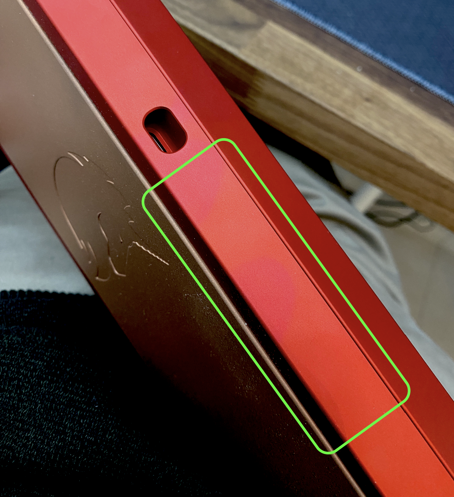
    

Я не знаю наверняка из-за чего происходит подобное. Возможно, дело и правда в pH-кожи, а возможно (как в случае с Unikorn), кто-то протер руки какой-то странной антибактериальной штукой и после этого взял клавиатуру, из-за чего и появились эти следы.

# Выцветание анодного слоя из-за underglow-подсветки

источник: [https://kbd.news/Discolored-aluminum-case-1153.html](https://kbd.news/Discolored-aluminum-case-1153.html)

спасибо за наводку: [https://t.me/zullkree](https://t.me/zullkree)

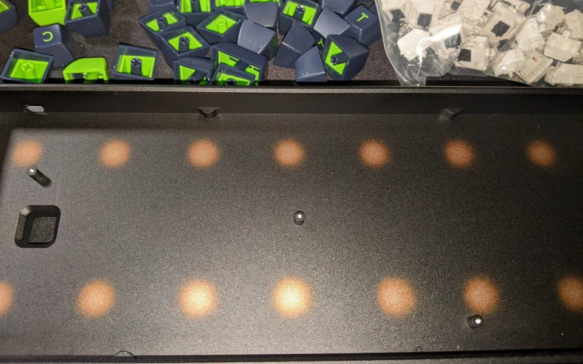