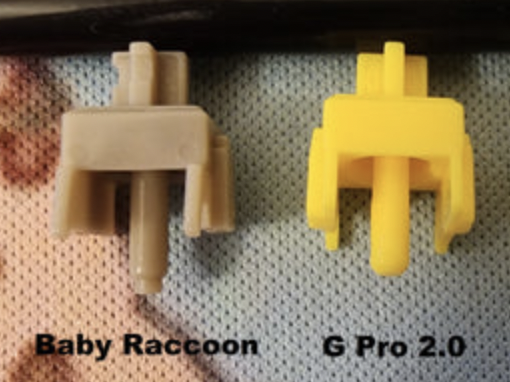

# Чем отличается обычный свич от long-pole

Owner: keebcult

Стем лонг-пол свича длиннее, из-за чего стержень бьется о дно хаузинга и добавляет свичу специфичный звук. Это также влияет на длину хода свича.

long-pole слева