# Что мы знаем о плейтах?

Owner: keebcult

авторы: [@kapee1](http://t.me/kapee1), [@ForgottenHunter](http://t.me/ForgottenHunter), [@sensetrigger](https://t.me/+WmaYoxoEIkg1NDky), [@skimo_only](http://t.me/skimo_only)

редактор: [@sensetrigger](https://t.me/+WmaYoxoEIkg1NDky)

фото и саунд-тесты: [@ForgottenHunter](http://t.me/ForgottenHunter)

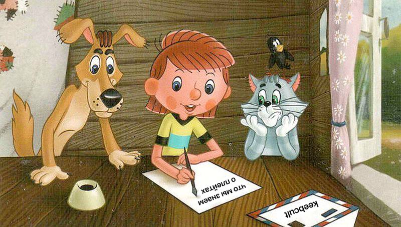

<aside>
⚠️ **Важные уточнения**

- Эта статья – общая рекомендация, а не конкретное руководство. Ее цель – сузить круг подходящих вам вариантов. Лучший способ понять какой плейт вам нужен – попробовать самому.
- Универсального плейта для всех – не существует, но есть те, которые прощают больше недостатков.
- Наличие плейта и материал, из которого он изготовлен, сильно влияют на звук и ощущения при печати.
- Характеристики сплавов или миксов пластиков, даже с одинаковой маркировкой, могут значительно отличаться у разных производителей.
</aside>

# Особенности

## Толщина

Стандарт для МХ – переключателей  –  1.5 мм.

В силу особенностей производства, плейты из FR4 могут иметь толщину 1.6мм.

Для ALPS и Choc переключателей используется толщина 1.2 мм.

Так же существуют вариации латунных и медных плейтов толщиной 4мм, но это скорее экзотика и рассматривать такое здесь будет не совсем правильно.

<aside>
⚠️ Главным неудобством plateless и half-plate является необходимость припаивания свичей. 

Некоторые PCB имеют очень плотные посадочные места, которые крепко держат свичи (что позволяет использовать для плейтлесс хотсвап-платы), но даже они со временем могут “разболтаться” (особенно после кучи пересобираний клавиатуры).

</aside>

## Plateless

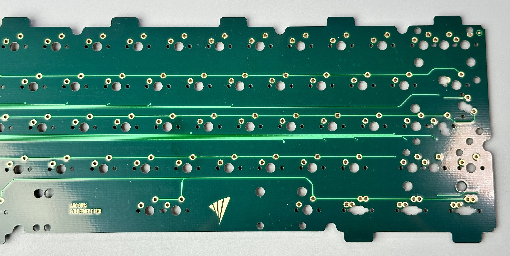

Конфигурация, когда в сборке отсутствует плейт. Часто использовалась в старых клавиатурах Cherry.

- Как правило, чем больше размер клавиатуры – тем больше флекса будет у plateless. Также на его количество сильно влияет наличие флекс-катов у PCB.
- При пайке plateless-сборок рекомендуется использовать [align plate](https://geon.works/products/plates-for-w1-at-1) либо [вилку](https://geon.works/products/geon-plate-support-fork).
- Для plateless подходят только клавиатуры с pcb-mount (крепление к корпусу происходит через PCB, а не через плейт).

## Half-plate

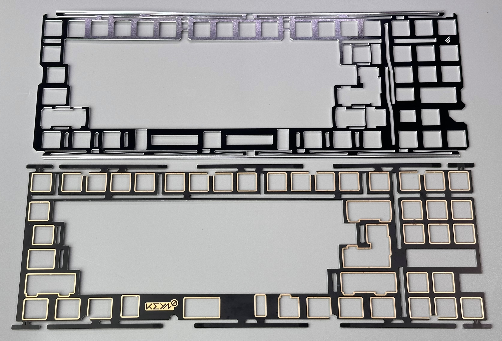

Конфигурация плейта, где часть плейта отсутствует в области альф (букв). Как правило, для half-plate используют жесткие плейты: алюминий, карбон, FR4.

- Тайпфил в области альф похож на plateless
- "Жесткие" модификаторы. Во время нажатия модификаторов – клавиатура будет ощущаться более "сбитой", чем при сборке без плейта совсем.
- Крепления сборки может происходить не только за PCB, но и за плейт.

Half-plate позволяет получить ощущения близкие к plateless даже на тех клавиатурах, где plateless не был предусмотрен.

Приятным бонусом является тот факт, что звук модов на half-plate будет гораздо более плотным/сбитым/выразительным (в отличии от plateless, где моды частенько звучат пустовато – так называемый “hollow sound”).

## Flex-cuts / Флекс-каты

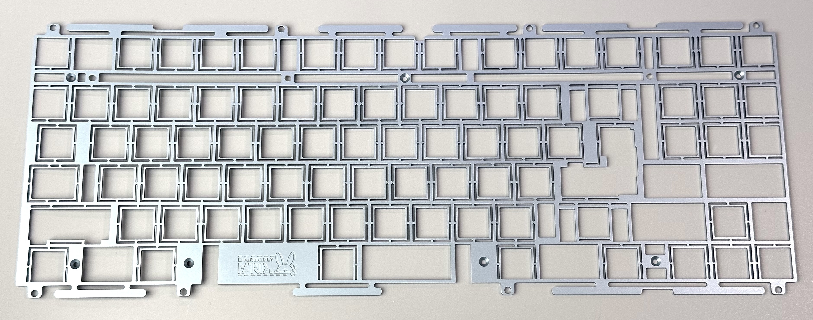

Вырезы в плейте для уменьшения его "жесткости".

Наличие флекс-катов позитивно влияет на «мягкость» плейта, но пагубно влияет на звук в сборках без фоама (делая его более тонким и «пустым»).

# Материалы

При описании материалов мы будем опираться на стандартную конфигурацию плейта  –  полный плейт, без флекс-катов.

## Жесткие

### Aluminum / Алюминий

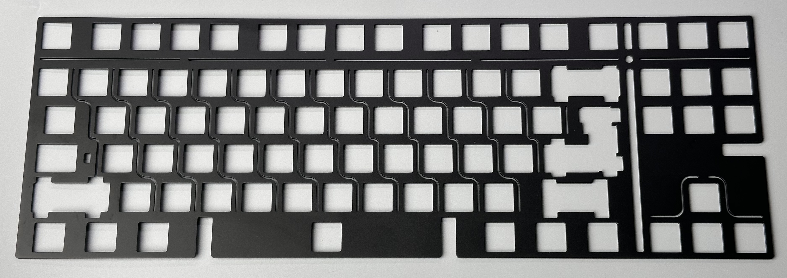

Самый распространённый материал для плейта. Как правило, достаточно жесткий (есть исключение в виде комплектного плейта для Geonworks F1-8X – Aluminum 1.5mm Leaf Spring V1.1, его легко погнуть руками), но в то же время может чуть-чуть деформироваться при печати. Не очень упругий и достаточно плотный материал.

Изготавливается из разных марок алюминия  –  50хх, 60хх, 70хх.

Предположительные отличия:

- 50хх – самый мягкий и самый распространённый.
- 60хх (6061, 6063) – жестче, чем 50xx
- 70хх – жестче, чем 60хх

Звук с алюминиевым плейтом стремится скорее к высокому (high pitch), нежели к низкому (low pitch).

### FR4 / Текстолит

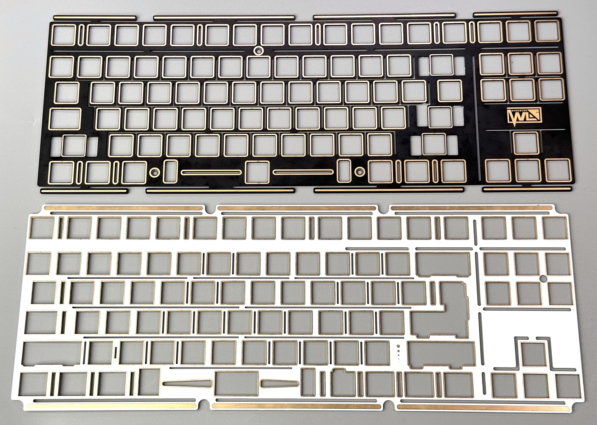

Один из самых универсальных и “безопасных” вариантов среди всех перечисленных плейтов.

FR4 служит неким “уравнителем” тональности и хорошо показывает себя в любом билде.

Low-pitch клавиатуры становятся еще более приглушенными и низко звучащими.

High-pitch свичи становится чуть менее яркими и более "бархатным" (особенно актуально для сборок с PE-foam).

При этом, FR4 "заглушает" множество паразитных звуков свитчей, делая лиф-пинг/спринг пинг/звук песка чуть менее заметным.

Благодаря низкой цене и особенностям, описанных выше, FR4 стал самым популярным плейтом для creamy/marbly сборок.

<aside>
✅

Хороший "безопасный" вариант, если пока не понятно чего именно хочется.

</aside>

### Carbon fiber (CF) / Карбон

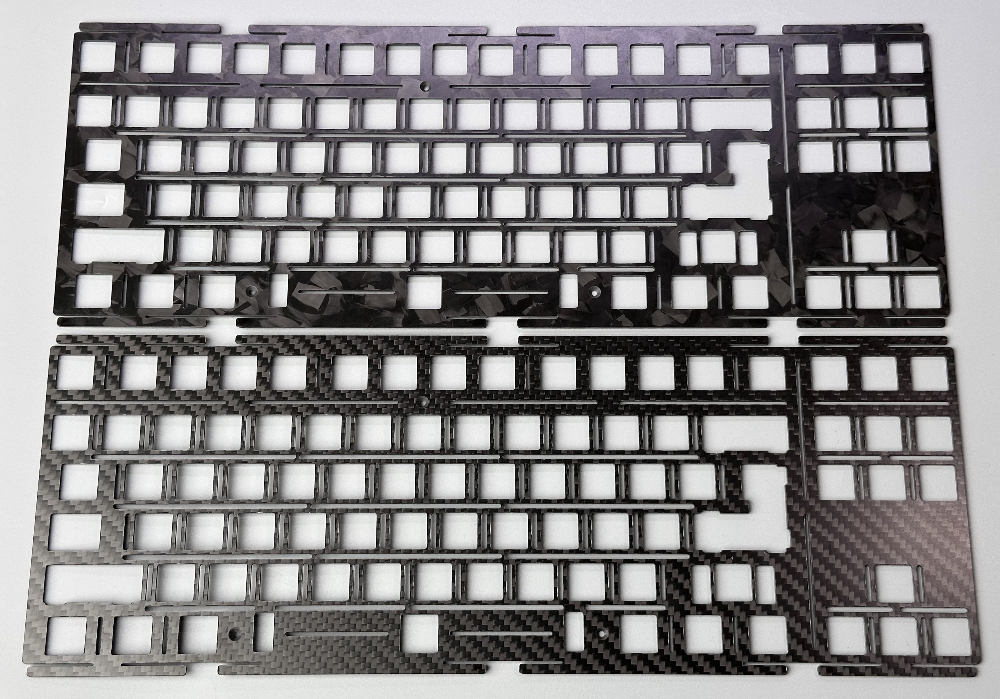

Forged carbon fiber

Traditional carbon fiber

Специфичный и очень ситуативный материал. Боттом-аут ощущается очень жестким (как будто плейт сделан из стекла), хотя сам плейт в руках может показаться мягким и даже немного флексить. Основной материал такого плейта  –  это смола. Она склоняет звук к высокой тональности (high pitch). Такие плейты очень восприимчивы к паразитным звукам свитчей.

Звук более "сухой" и громкий, нежели у алюминиевого плейта.

Точно не нужно выбирать его в качестве основного или первого плейта. Его стоит покупать только в паре с другими (для "пробы", или если вы точно знаете, для чего он вам нужен).

Разница между обычным карбоном и forged в основном только визуальная.

### Brass / Латунь

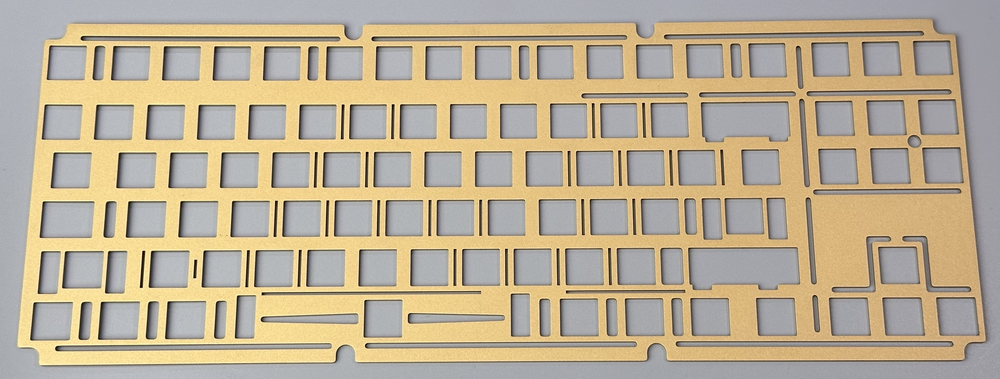

Латунь – дорогой, твердый, тяжелый и далеко не самый популярный вариант. Часто используется для придания клавиатуре более премиального вида и веса.

Имеет жесткий боттом-аут и более ярко-выраженный "металический" отзвук, нежели алюминий. За счет этого пользуется популярностью при использовании в билдах с тактильными свитчами (например, для крафтовых holy panda), ради достижения максимального "долбилова".

Звук имеет небольшой уклон в высокую тональность, с чуть более приглушенными (muted) нотками за счет высокой плотности материала.

### Steel / Сталь

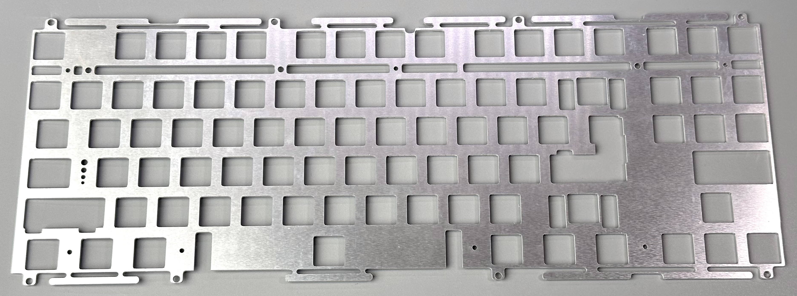

Стальные плейты любят использовать корейские дизайнеры.  Иногда их можно встретить в пребилдах (например, в Leopold, или в некоторых Keychron) из-за дешевизны производства. А еще стальной плейт можно найти во всех актуальных topre-клавиатурах (кроме HHKB).

Боттом-аут ощущается очень жестким, звук ближе к high pitch. Из-за высокой плотности и упругости, гораздо сильнее склонен резонировать и передавать различные паразитные вибрации.

Разница между стальным и алюминиевым плейтом не так велика, как кажется, но она определенно есть и будет заметна при сравнении в лоб.

Стальной плейт это неплохой выбор, если есть возможность его локально дешево изготовить.

<aside>
⚠️ Также имейте ввиду, что со временем стальной плейт может начать ржаветь.

</aside>

## Мягкие

Для сборки клавиатур с мягкими плейтами рекомендуется использовать вилку (plate fork), поскольку без поддержки извне плейт может проваливаться к плате.

### Polycarbonate (PC) / Поликарбонат

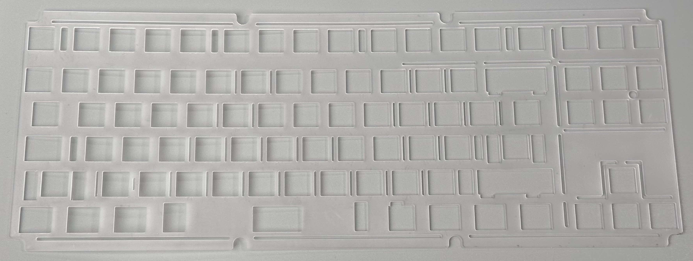

Самый популярный комплектный плейт в бюджетном ($100-$230) сегменте клавиатур.

Производители клавиатур в этом ценовом сегменте делают основную ставку на "флекс" (пружинящий/мягкий тайпинг), и поликарбонат отлично подходит для этих целей.

Тональность у него низкая (low pitch) и немного объемная. Поликарбонат особенно актуален в клавиатурах с PE-foam с уклоном в thocky/marbly звучание.

Но из-за low-pitch характера он не очень хорошо сочетается с билдами без фоама. 

### **Polyoxymethylene (**POM) / П**олиоксиметилен (ПОМ)**

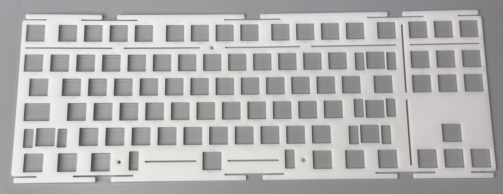

По звуку он все еще находиться ближе к low-pitch тональности, при этом звук не такой низкий как на PC и не такой "приглушенный" как на FR4.
POM’y характерен более яркий, «живой» звук по сравнению с двумя предыдущими плейтами, при этом звук щелчка (боттом-аута) на нём выражен гораздо сильнее.

Универсальный плейт-компаньон для Long-Pole свитчей в любом виде сборок (как с фоамом, так и без него).
Чуть хуже заглушает шумы в свитчах, поэтому более требователен к качеству свитчей.

<aside>
✅ Это отличный универсальный вариант среди мягких плейтов для большинства клавиатур.

</aside>

### Polypropylene (PP) / Полипропилен

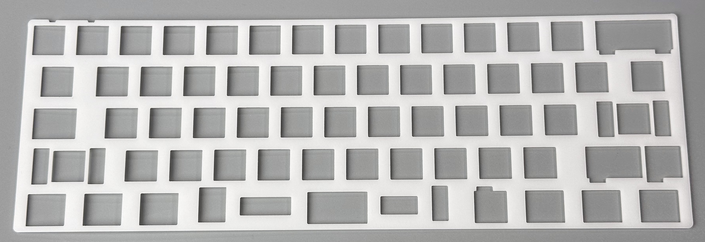

PP вобрал в себя низкую тональность и мягкость от PC и чуть более ярко выраженный звук боттом-аута от POM.

Довольно интересное решение если вам уже надоели стандартные материалы.

Видео про pp-plate от TofuTypes: [https://www.youtube.com/watch?v=12D0MedH6V8](https://www.youtube.com/watch?v=12D0MedH6V8&pp=ygUIcHAgcGxhdGU%3D)

## Сортировка плейтов по жесткости

В порядке убывания (от жестких к мягким):

1. Карбон
2. Латунь
3. Алюминий (в некоторых случаях может быть мягче FR4)
4. FR4
5. Поликарбонат
6. ПОМ
7. Полипропилен

# Звук

## В фоамных клавиатурах

В порядке убывания (от high pitch до low pitch):

1. Латунь
2. Карбон
3. Алю
4. Полипропилен
5. ПОМ
6. FR4
7. Поликарбонат

## В клавиатурах без шумки

В порядке убывания (от high pitch до low pitch):

1. Карбон
2. Латунь
3. ФР4 (возможно, есть смысл поменять местами с алюмом)
4. Алюминий
5. Полипропилен
6. Поликарбонат
7. ПОМ

## Thoccy, creamy, marbly, clacky

У каждого свое понимание этих слов (поэтому мы не любим их использовать), поэтому прежде чем использовать подобную терминологию, укажем свое видение:

- **Marbly** – более низкий и бархатный звук лонг-пол свичей
    
    [Suit, Aluvia, FR4, Epsilon.mp3](Что мы знаем о плейтах/Suit_Aluvia_FR4_Epsilon.mp3)
    
- **Creamy** – чуть более яркий и громкий звук лонг-пол свичей в фоамных клавиатурах
    
    [PC, Zaku, Suit, GMK.mp3](Что мы знаем о плейтах/PC_Zaku_Suit_GMK.mp3)
    
    [Suit Durock POM.mp3](Что мы знаем о плейтах/Suit_Durock_POM.mp3)
    
    Разница между marbly и creamy не очень велика (и понятна), поэтому для удобства проще объединить их в одну категорию. 
    
- **Thoccy** - low pitch (при использовании использования low-pitch свичей, типа Gateron Oil King, Durock POM, Sarokeys BCP и т.д.).
    
    [GMMK, Durock POM. FR4, MT3.mp3](Что мы знаем о плейтах/GMMK_Durock_POM._FR4_MT3.mp3)
    
- **Clacky** – громкое звучание с уклоном в high pitch
    
    [F2, Zaku, FR4 Half, GMK (no foam).mp3](Что мы знаем о плейтах/F2_Zaku_FR4_Half_GMK_(no_foam).mp3)
    

### Лучшие плейты под thocc

1. ФР4
2. Поликарбонат
3. ПОМ
4. Алю (с натяжкой)

### Лучшие плейты под creamy/marbly

1. POM
2. FR4

### Лучшие плейты под clacky

Сильно зависит от клавиатуры и маунта.

Для clacky рекомендуется билд без шумок и плейта (либо с халф-плейтом). В качестве свичей – Zaku, BCP и другие “громкие” лонг-полы (либо что-то нейлоновое типа MX Black, для более “умеренного” clacky).