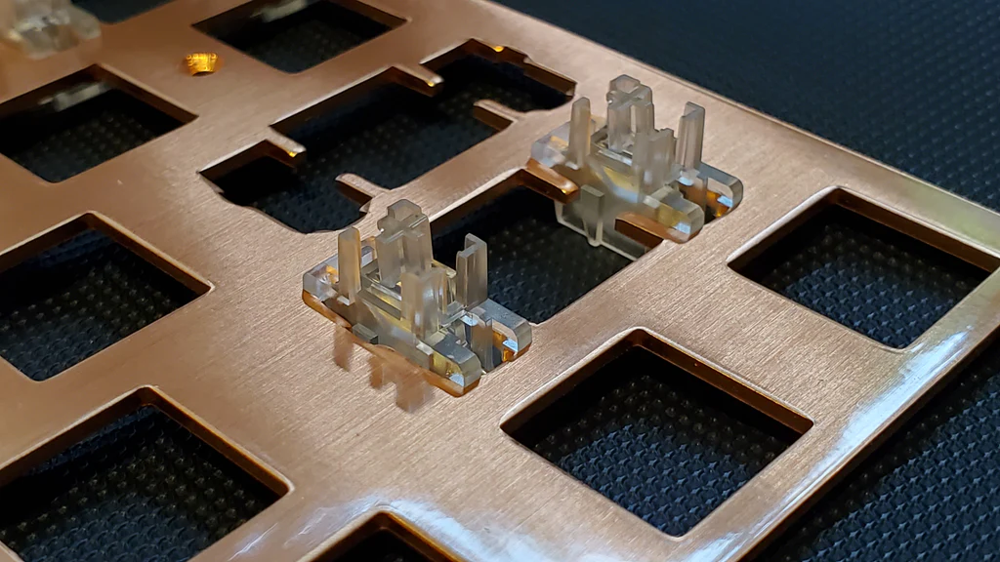

# Что такое стабилизаторы и как их выбирать

Owner: keebcult

автор: [@kapee1](https://t.me/kapee1), большое спасибо за помощь с написанием [@ForgottenHunter](https://t.me/ForgottenHunter)

<aside>
💡

</aside>

Из чего, обычно, состоят МХ-совместимые стабилизаторы:

1. Скоба (Wire) - металлическая проволока, согнутая в нескольких местах.
2. Хаузинг (Housing) - пластиковая деталь, которая крепится к плейту или PCB, она удерживает стем. Во время работы стабилизатора - хаузинг остается неподвижным.
3. Стем (Stem) - пластиковая деталь, которая непосредственно контактирует с кейкапом. Стемы двигаются внутри хаузингов во время нажатия на клавишу, а скоба позволяет им двигаться синхронно.

## Особенности для МХ стабилизаторов

### *Типы крепления к клавиатуре*

Делятся на два вида: крепление за плейт или крепление за PCB.

- Plate-mount (хаузинг стабилизатора защелкивается в плейт). Этот тип крепления обычно используется в пребилдах или там, где невозможно использовать крепление за PCB, например хендваер, клавиатуры с маунтом o-ring или в редких случаях при сборке кастомной topre-клавиатуры.
    
    
    Из недостатков можно выделить:
    *- "Гуляющие" допуски у разных производителей. Из-за чего разные plate-mount стабилизаторы могут либо болтаться, либо очень туго садиться в посадочное место и вызывать залипание стема стаблизаторов. Обычно это случается, когда посадочное место плейта сдавливает стабилизатор, из-за чего пространство внутри хаузинга уменьшается и стем начинает залипать.
    - Меньший выбор качественных вариантов (из топ-сегмента -- там присутствуют только ТХ)
    + Главным преимуществом является возможность достать стабилизатор без разборки самой клавиатуры. Достать свитч, отщелкнуть стабилизатор и его можно легко обслужить. (Если в плейте клавиатуры есть необходимый вырез для скобы).*
    
    
    
    Пример plate-mount стабилизатора
    

- PCB-mount (Хаузинг стабилизатора крепится только к PCB винтами/клиньями/защелками). Наиболее популярный формат из-за своей универсальности. Эти стабилизаторы возможно использовать на клавиатурах без плейта. Однако, из-за бОльшего размера хаузинга, screw-in (крепление к PCB с помощью винтов) стабилизаторы могут быть несовместимы с клавиатурами на o-ring маунте.
PCB-mount стабилизаторы более популярны, поэтому существует огромное количество вариантов.
    
    
    Главными плюсами является:
    *+ Большая популярность, благодаря чему мы имеет разнообразие опций.
    + Конкуренция заставляет производителей постоянно совершенствовать уже имеющиеся опции.
    + Возможность использовать в plateless сборках (на голой PCB)*
    
    *- Недостатком же, является необходимость полной разборки клавиатуры для обслуживания стабилизаторов. Некоторые производители решили данную проблему изменением конструкции плейта, который позволяет снимать стабилизаторы без необходимости снимать все свитчи и кейкапы.*
    
    
    
    Пример PCB-mount стабилизатора
    

### *Размеры скоб*

Размеры скоб стабилизаторов зависят от лейаута вашей клавиатуры.
Если есть необходимость сделать из 2u стабилизатора → 3u, или из 6.25u → 7u, то необходимо просто установить скобу нужного размера из набора. Скобы можно покупать отдельно, но толщина скоб в зависимости от производителя может отличатся, есть вероятность, что скобы могут быть слишком толстыми или, наоборот, слишком тонкими и болтаться. Самый распространённый диаметр скобы = 1.6 мм +- 0.05
Вот табличка зависимости размера кейкапов от размера скобы

| Размер кейкапа, юниты | Размеры скобы, юниты |
| --- | --- |
| 2 | 2 |
| 2.25 | 2 |
| 2.75 | 2 |
| 3 | 3, 2* |
| 6 | 6 |
| 6.25 | 6.25 |
| 7 | 7 |
| 8 | 8 |
| 10 | 7, 8* |

<aside>
💡 * Должна быть поддержка этого размера как на PCB, так и нужные посадочные места под стабилизатор на кейкапе

</aside>

### *Совместимость стабилизаторов и PCB*

В современных МХ-клавиатурах используются две толщины PCB — 1.2 мм, 1.6 мм.
Обычно, производитель клавиатуры указывает эту информацию либо в спецификации, либо на рендере с полной комплектацией клавиатуры.
Если для стабилизаторов не указана необходимая толщина PCB, вероятнее всего они подходят для стандартной толщины = 1.6 мм.

- Если толщина вашей PCB = 1.6 мм, то можно использовать только стабилизаторы под 1.6 мм.
- Если толщина вашей PCB = 1.2 мм, можно использовать либо специальные стабилизаторы под 1.2 мм, либо использовать любые стабилизаторы под 1.6мм вместе со специальными проставками, обычно их называют stabilizers shims:

Проставки для использовании 1.6 мм стабилизаторов в 1.2 мм PCB

### *Совместимость стабилизаторов и свитчей*

Современные МХ-подобные свитчи могут иметь ход от 3 мм до 4 мм. Это параметр обычно указан в характеристиках свитча как 'Total Travel'.

Большинство стабилизаторов рассчитано на свитчи со стандартным размером хода = 4 мм.
При использовании long-pole свитчей и обычных стабилизаторов, может возникать перекос кейкапа в конце хода "длинных" клавиш. Это происходит из-за того, что свитч достигает своей нижней точки и стем свитча уже упирается в нижний хаузинг свитча и центр кейкапа не может уйти еще ниже, однако же стабилизаторы еще не достигают своей нижней точки и кейкап по краям уходит ниже, чем в центре. В некоторых случаях, это может вызывать "слетание" кейкапа.

<aside>
💡 Чтобы избежать подобной ситуации - необходимо использовать специальные стабилизаторы, которые сделаны специально под long-pole свитчи. TX выпускает подобные стабилизаторы, они предназначены для свитчей с ходом 3.6 мм и меньше.

</aside>

Однако, не рекомендуется использовать long-pole стабилизаторы в паре со свитчами с стандартным ходом в 4мм. Звук от клавиш со стабилизаторами будет значительно отличаться от всех клавиш без стабилизаторов в худшую сторону. 

### *Чем и как смазывать*

| Что мазать | Чем мазать | Где мазать |
| --- | --- | --- |
| Стем | Krytox 205g0, Tribosys 3204\3203 | Тонким слоем на наружных стенках |
| Хаузинг | Krytox 205g0, Tribosys 3204\3203 | Тонким слоем в местах касания стема |
| Скоба | Krytox 205г2, Permatex, Krytox XHT-BDZ | Обильно на коротких частях скобы и скруглениях. Если есть шприц с широкой иглой, можно добавить смазку в уже собранный стабилизатор, внутрь стема, куда вставляется скоба. |

[Хороший, хоть и старый гайд по смазке стабилизаторов ](https://www.youtube.com/watch?v=usNx1_d0HbQ)

Хороший, хоть и старый гайд по смазке стабилизаторов 

### *Какие рассмотреть к покупке*

Мнения по поводу стабилизаторов очень разняться - у всех совершенно разные опыт использования одних и тех же стабилизаторов, поэтому однозначного фаворита назвать сложно.
Из наиболее популярных:

- TX AP - очень маленькие допуски, поэтому крайне желательно смазывать именно XHT-BDZ. Из-за своих свойств она держится дольше всего, стабы придется реже пересмазывать.
Много разных цветов, существуют как под 1.2 мм, так и под 1.6 мм, есть и обычная, и long-pole версии.
Еще они различаются по типу креплений:
Clip-in -крепление за PCB с помощью клипс.
Screw-in - крепление за PCB с помощью винтов.
Комплекты:
    - **3 * 2U**
    - **5 * 2U + 6.25u + 7u**
    
    Не требуют никаких модификаций кроме смазки.
    
    
    
    TX AP - для long-pole  свитчей, под 1.2 мм PCB, тип крепления — clip-in
    

- TX rev.3 - см. TX AP, но с большими зазорами между стемом и хаузингом. Из-за этого клавиша может немного "ходить" вперед-назад. Все еще отличный выбор, если у вас нет возможности купить BDZ.
    
    Комплекты:
    
    - **3 * 2U**
    - **5 * 2U + 6.25u (WK)**
    - **5 * 2U + 7u (WKL)**
    
    Не требуют никаких модификаций кроме смазки.
    
    
    
    TX rev.3 для 1.6 мм PCB,  тип крепления — clip-in
    

- Owlab v2 - только screw-in, из-за уникальной конструкции подходят и под 1.2 мм и под 1.6 мм PCB. Разные наборы под TKL и Full-Size.
Много цветов, качество может плавать, отзывы разнятся. Я использую их в своих клавиатурах, меня устраивают.
Комплекты:
    - **4 * 2U + 6.25u + 7u**
    - **7 * 2U + 6.25u + 7u**
    
    Не требуют никаких модификаций кроме смазки.
    
    
    
    Owlab v2, TKL-set
    
- Aeboards Staebies v2.1 - отличные стабилизаторы. Только screw-in, только под 1.6 мм.
Раньше было трудно купить, сейчас продаются даже на али.
Рекомендуют брать версию из нейлона из-за лучшего звука, хоть и ход там чуть-чуть более тугой, из-за трения нейлон-нейлон.
Прозрачные издают очень неприятный звук при ударе о PCB, там обязательно нужны тефлоновые прокладки что бы немного приглушить звук.
    
    Комплект:
    
    - **5 * 2U + 6.25u + 7u**
    
    Не требуют никаких модификаций кроме смазки.
    
    
    
    Aeboards Staebies v2.1, из нейлона и ПК
    

- TypePlus - подробный отзыв от Кирилла [[https://keebcult.notion.site/dcb9da87bcb44263967e8fad7cbafbe1](%D0%9D%D0%B0%20%D0%BA%D0%B0%D0%BA%D0%B8%D0%B5%20%D1%81%D1%82%D0%B0%D0%B1%D0%B8%D0%BB%D0%B8%D0%B7%D0%B0%D1%82%D0%BE%D1%80%D1%8B%20%D1%81%D1%82%D0%BE%D0%B8%D1%82%20%D0%BE%D0%B1%D1%80%D0%B0%D1%82%D0%B8%D1%82%D1%8C%20%D0%B2%D0%BD%D0%B8%D0%BC%D0%B0%D0%BD%D0%B8%D0%B5%20dcb9da87bcb44263967e8fad7cbafbe1.md)], но еще рано судить, других отзывов пока мало
    
    
    

<aside>
💡

Стабилизатор - механизм для "стабилизации" длинных клавиш (>1.75 юнита). Стабилизаторы позволяют нажимать длинную клавишу в любом месте, без риска закусывания и перекоса кейкапа.

</aside>